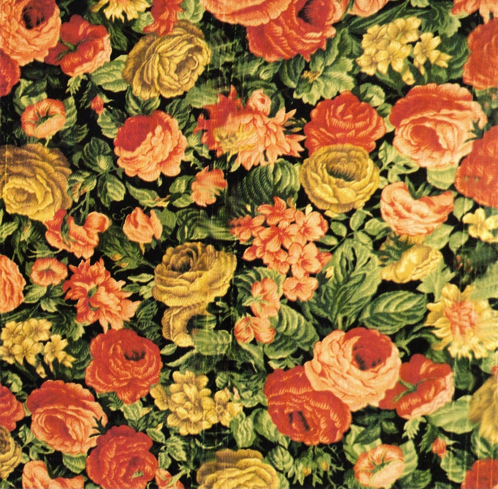
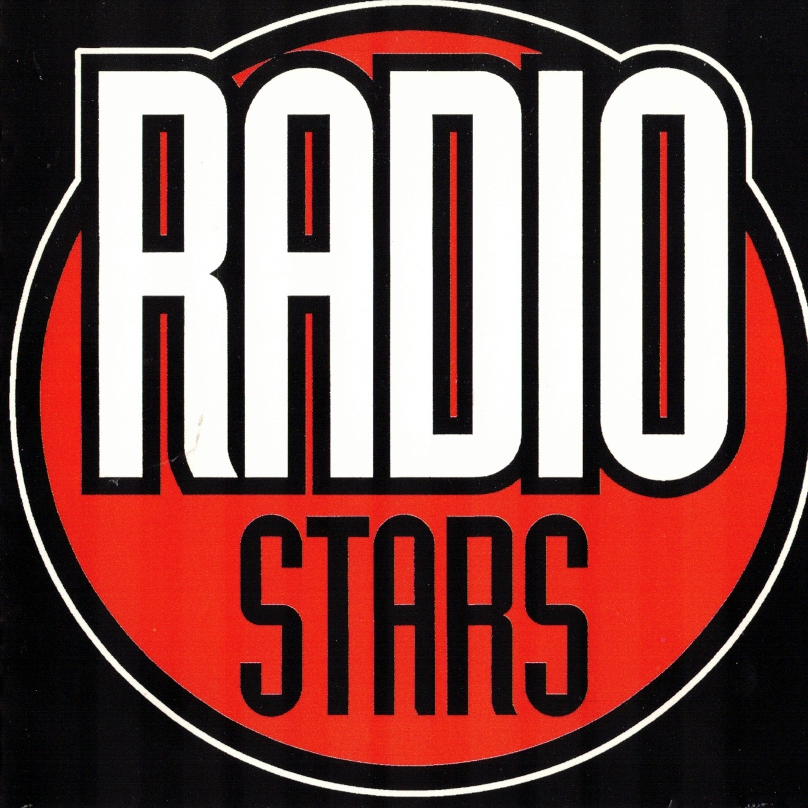
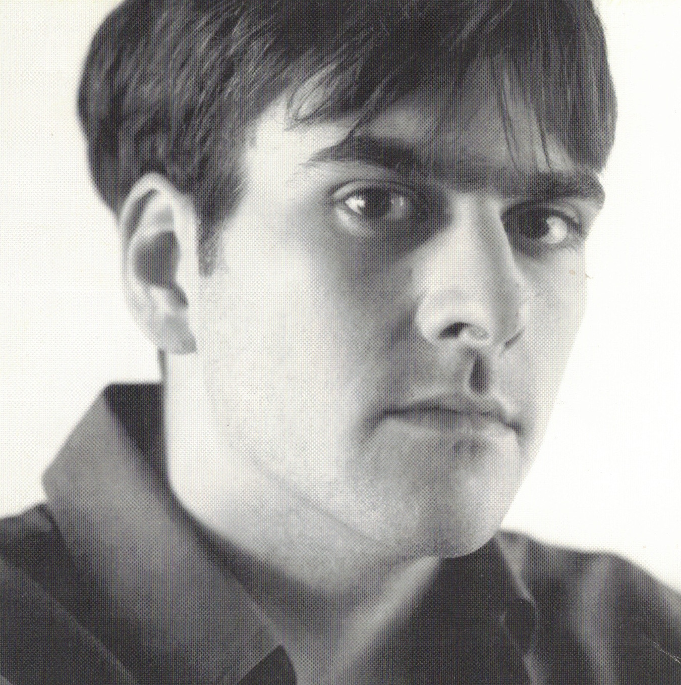
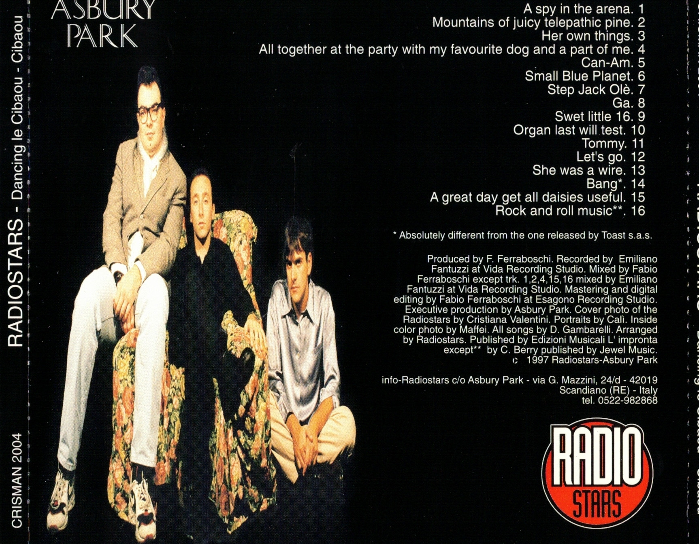



Album released 1997

| #     | Lista delle tracce                    |               |
| :---: | :---                                  | :---          |
| 1     | A spy in the arena                    |               |
| 2     | Mountains of juicy telepathic pine    |
| 3     | Her own things                        |
| 4     | All together at the party with my favourite dog and a part of me |
| 5     | Can-Am                                |
| 6     | Small Blue Planet                     |
| 7     | Step Jack Olè                         |
| 8     | Ga                                    |
| 9     | Sweet little 16                       |
| 10    | Organ last will test                  |
| 11    | Tommy                                 |
| 12    | Let's go                              |
| 13    | She was a wire                        |
| 14    | Bang                                  |
| 15    | A great day get all daisies useful    |
| 16    | Rock and roll music                   |

## Recensioni



## Interviste



## Live



## Gallery

    
    
    
    
    
    

