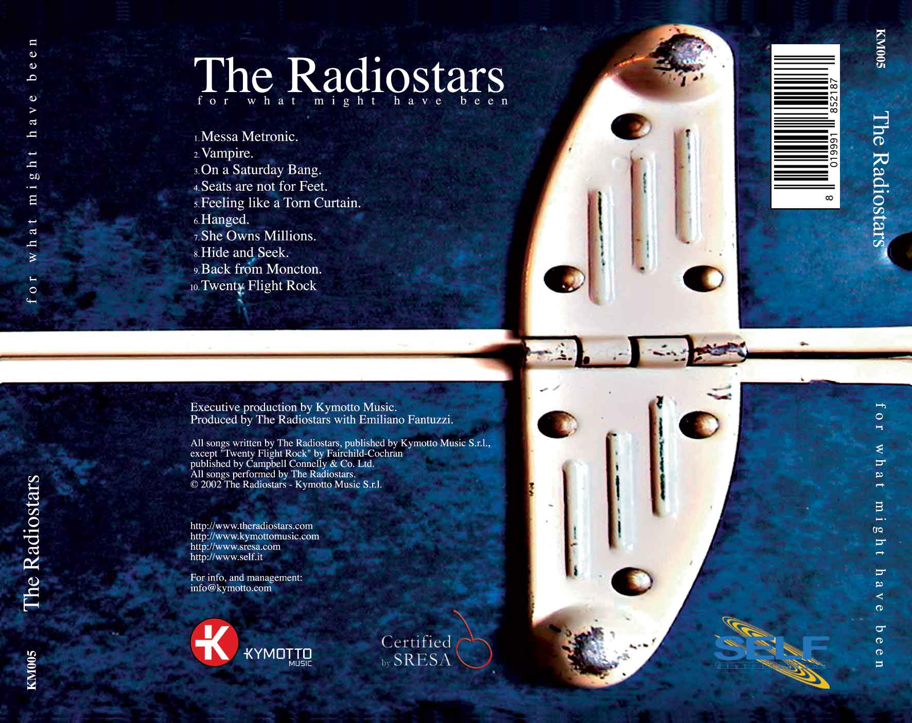
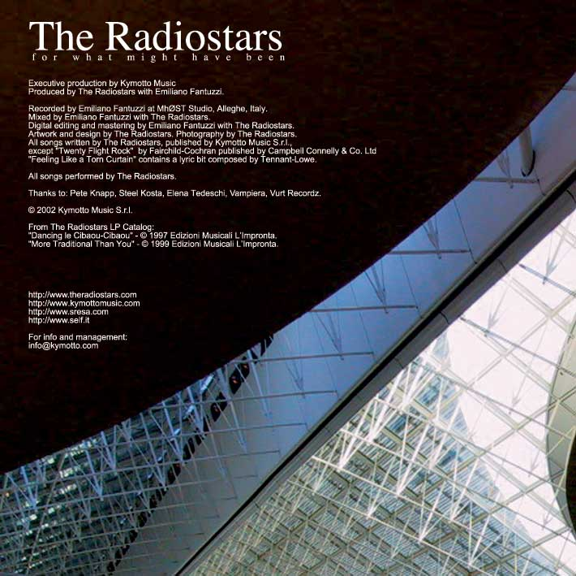


   
Album released 2003

<!-- 
Play on Jamendo
 -->

| #     | Lista delle tracce                    |               |
| :---: | :---                                  | :---          |
| 1     | Messa Metronic                        |               |
| 2     | Vampire                               |               |
| 3     | On a Saturday Bang                    |               |
| 4     | Seats are not for Feet                |               |
| 5     | Feeling like a Tom Curtain            |               |
| 6     | She Owns Millions                     |               |
| 7     | Hide a Seek                           |               |
| 8     | Back from Moncton                     |               |
| 9     | Twenty Flight Rock                    |               |

## Interviste


## Gallery

    
    
    

