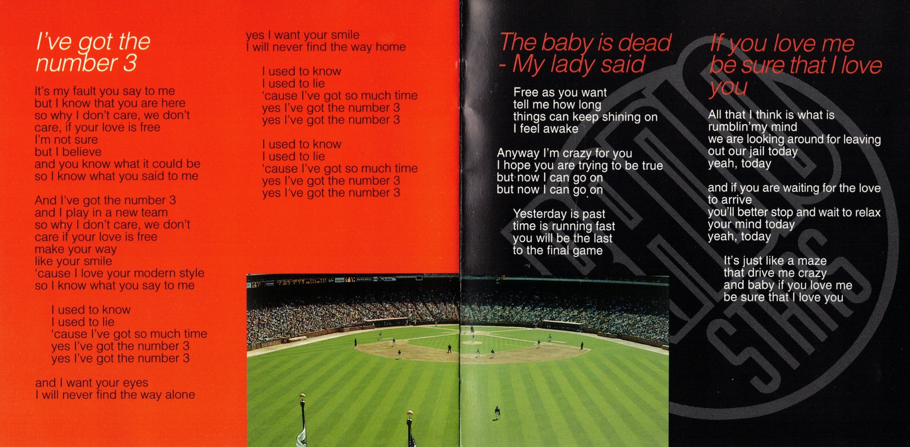

<!-- [](https://www.jamendo.com/album/27539/endless-morning "Jamendo") -->

<!-- Availabe on [Jamendo](https://www.jamendo.com/album/27539/endless-morning "Jamendo"), Spotify -->



Album released 1999
<!-- 
Play on Jamendo
 -->

| #     | Lista delle tracce                    |               |
| :---: | :---                                  | :---          |
| 1     | Spy 99                                |               |
| 2     | She does not say goodbye              |               |
| 3     | East coast to west                    |               |
| 4     | Two wives and a kid to support        |               |
| 5     | I've got the number 3                 |               |
| 6     | The baby is dead - My lady said       |               |
| 7     | If you love me be sure that I love you |               |
| 8     | In your ocean flat                    |               |
| 9     | Violet ice turn red in orange light   |               |
| 10    | Roll over Beethoven                   |               |

## Interviste


## Gallery

    
    
    
    
    
    
    

