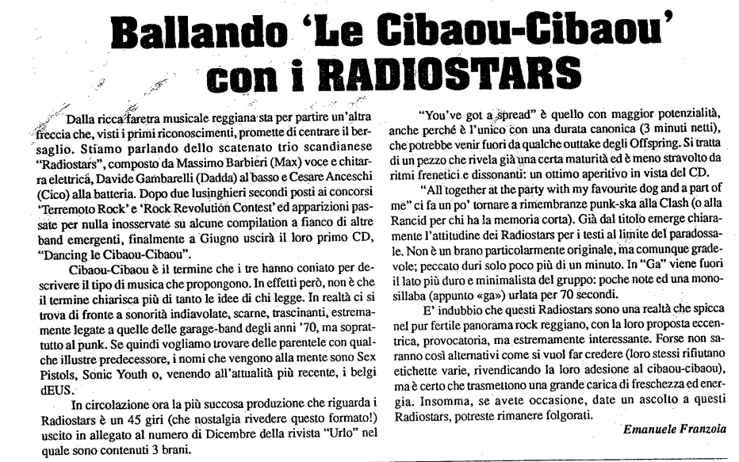

Articolo di Emanuele Franzoia il periodico "Scandiano Giovani" uscito nel mese di lugio 1997

Dalla ricca faretra musicale reggiana sta per partire un’altra freccia che, visti i primi riconoscimenti, promette di centrare il bersaglio. Stiamo parlando dello scatenato trio scandinase “Radiostars”, composto da Massimo Barbieri (Max) voce e chitarra elettrica, Davide Gambarelli (Dadda) al basso e Cesare Anceschi (Cico) alla batteria. Dopo due lusinghieri secondi posti ai concorsi 'Terremoto Rock' e 'Rock Revolution Contest' ed apparizioni passate per nulla inosservate su alcune compilation a fianco di altre band emergenti, finalmente a Giugno uscirà il loro primo CD, “Dancing le Cibaou-Cibaou”.

Cibaou-Cibaou è il termine che i tre hanno coniato per descrivere il tipo di musica che propongono. In effetti però, non è che il termine chiarisca più di tanto le idee di chi legge. In realtà ci si trova di fronte a sonorità indiavolate, scarne, trascinanti, estremamente legate a quelle delle garage-band degli anni ’70, ma soprattutto al punk. Se quindi vogliamo trovare delle parentale con qualche illustre predecessore, i nomi che vengono alla mente sono Sex Pistols, Sonic Youth o, venendo all’attualità più italiana, i dEUS.

In circolazione ora la più succosa produzione di quegli irruenti Radiostars è un 45 giri (che nostalgia rivedere quei formati!) uscito alla fine dell’anno dal Dicembre della rivista “Urlo” nel 1996.

“You’ve got a spread” è quello con maggior potenzialità, anche perché è l’unico con una durata canonica (3 minuti netti), che potrebbe venir fuori da qualche outtake degli Offspring. Si tratta di un pezzo che rivela già una certa maturità ed è meno stravolto da ritmi frenetici e dissonanti: un ottimo aperitivo in vista del CD.

“All together at the party with my favourite dog and a part of me” ci fa un po’ tornare a rimembranze punk-ska alla Clash (o alla Rancid per chi ha la memoria corta). Già dal titolo emerge chiaramente l’attitudine dei Radiostars per i testi al limite del paradossale. Non è un brano particolarmente originale, ma comunque gradevole; peccato duri solo poco più di un minuto. In “Ga” viene fuori il lato più duro e minimalista del gruppo: poche note ed una monosillaba (appunto «ga») urlata per 70 secondi.

È indubbio che questi Radiostars sono una realtà che spicca nel fertile panorama rock reggiano, con la loro proposta eccentrica, provocatoria, ma estremamente interessante. Forse non saranno così alternativi come si vuol far credere (loro stessi rifiutano etichette varie, rivendicando la loro adesione al cibaou-cibaou), ma di certo trasmettono una grande carica di freschezza ed energia. Insomma, se avete occasione, date un ascolto a questi Radiostars, potreste rimanere folgorati.

Emanuele Franzoia
