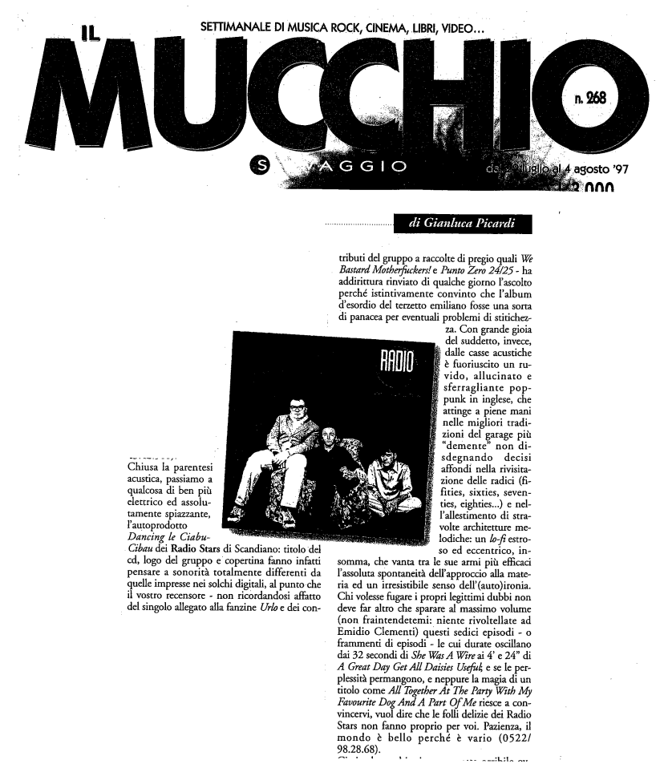

Articolo di Gianluca Picardi da [Mucchio Selvaggio](https://it.wikipedia.org/wiki/Il_mucchio_selvaggio_(rivista)) n.286 4 agosto 1997

...passiamo a qualcosa di ben più elettrico e spiazzante, l'autoprodotto *Dancing le Cibaou-Cibaou* dei RadioStars di Scandiano: titolo del cd, logo del gruppo e copertina fanno infatti pensare a sonorità totalmente differenti da quelle impresse nei solchi digitali, al punto che il vostro recensore - non ricordandosi affatto del singolo allegato alla fanzine Urlo e dei contributi del gruppo a raccolte di pregio quali *We Bastard Motherfuckers* e *Punto Zero 24/25* - ha addirittura rinviato di qualche giorno l’ascolto perché istintivamente convinto che l'album d'esordio del terzetto emiliano fosse una sorta di panacea per eventuali problemi di stiticheazza. Con grande gioia del suddeto, invece, dalle casse acustiche è fuoriuscito un ruvido, allucinato, sferragliante pop-punk in inglese, che attinge a piene mani nelle migliori tradizioni del garage più "demente" non disdegnando decisi affondi nella rivisitazione delle radici (fities, sixties, seventies, eighties..) e nell'allestimento di stravolte architetture melodiche: un *lo-fi* estroso ed eccentrico, insomma, che vanta tra le sue armi più efficaci
l'assoluta spontaneità dell'approccio alla materia ed un irresistibile senso dell'(auto)ironia.
Chi volesse fugare i propri legittimi dubbi non deve far altro che sparare al massimo volume
(non fraintendetemi: niente rivoltellate ad Emidio Clementi) questi sedici episodi - o fraramenti di episodi - le cui durate oscillano dai 32 secondi di *She Was A Wire* ai 4' e 24” di *A Great Day Get All Daisies Useful* e se le perplessità permangono, e neppure la magia di un
titolo come *All Together At The Party With My Favourite Dog And A Part Of Me* riesce a convincervi, vuol dire che le folli delizie dei Radiostars non fanno proprio per voi. Pazienza, il mondo è bello perché è vario.
