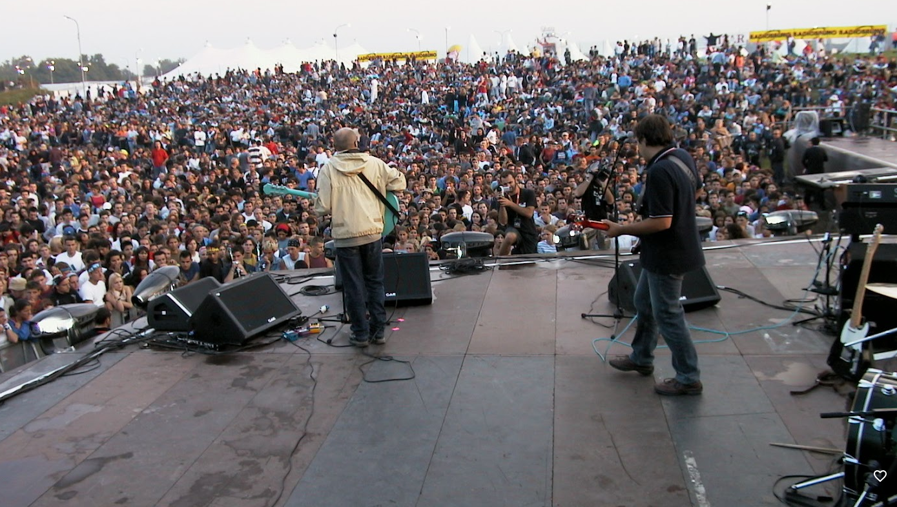
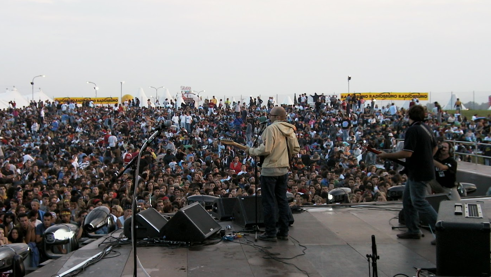
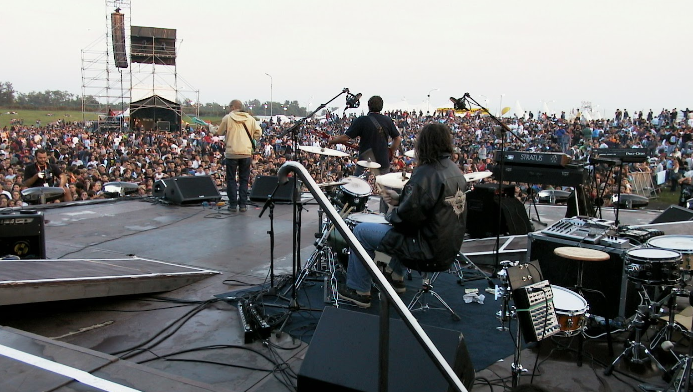
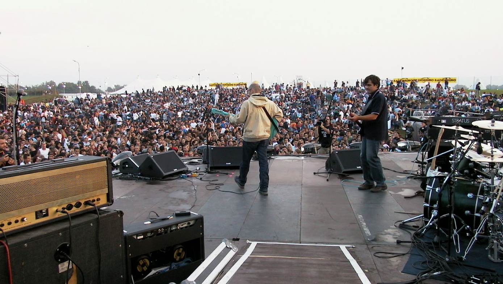
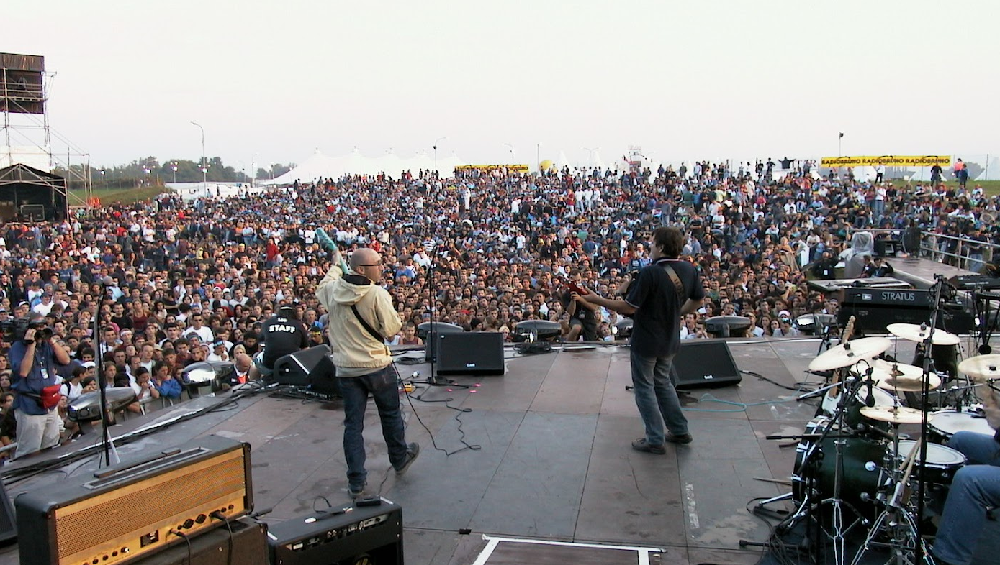
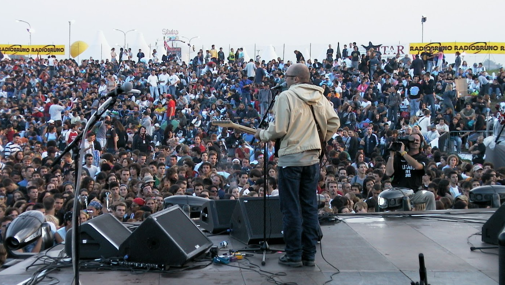
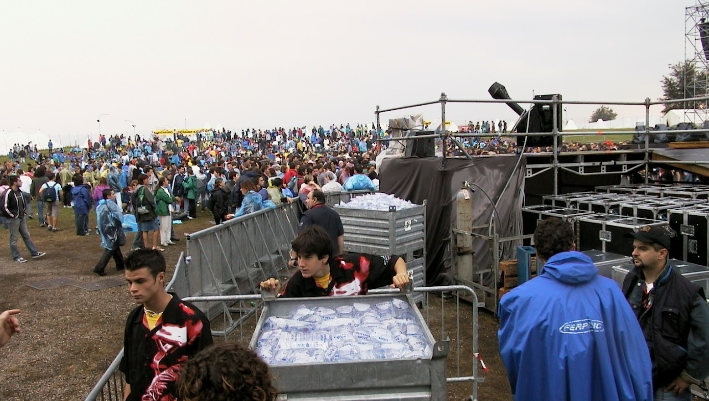

*Concerto in apertura a Ligabue, 12/09/2002*

Dopo che aprimmo il concerto degli U2 nel 1998 e Ligabue nel 2002 spesso, amici o fans, ci chiedessero: «...com'è suonare davanti a tanta gente?»

Durante i nostri live ci capitò di suanare davanti ad un pubblico "vasto". Quando suonammo all'inaugurazione del CSA Aquarius a Roncadella la stanza adibita al concerto, oltre ad essere priva di palco, era talmente murata di gente che cantai a 50 centimetri dalle prime file: avrei potuto allungare un braccio e dare una pacca sulla spalla al ragazzo di fronte a me che, assieme agli altri, cantava il ritornello di *Her own things*. Anche il CSA Inmensa di Genova, un capannone immenso che un tempo ospitava una mensa ora adibito Centro Sociale Autogestito, lo ricordo pieno imballato ...e la platea era immensa. Al Cavern di Scandiano, durante i nostri live, era normale vedere persone in piedi o all'esterno del locale. Tuttavia, in tutti i nostri concerti con un "vasto" pubblico, le persone erano centinaia, non decine di migliaia come nei concerti citati prima.

La differenza principale fra i diversi tipi di "vasto" è che il nostro "vasto" pubblico era lì per sentire i Radiostars, mentre il vasto pubblico di migliaia di persone paganti, ovviamente, non era lì per noi ma per gli U2 o per Ligabue. Quando salii sul palco, con un leggero groppo alla gola, ricordai le tradizionali bottigliate ai gruppi spalla, quando ancora era consentito introdurre agli spettacoli casse di acqua per placare la sete e punire i gruppi di apertura con gragnole di altissima, purissima e Levissima. In entrambi i concerti attaccammo i nostri jack e aprimmo con *Spy in the arena* e, già dalle prime note passò subito ogni timore: suono perfetto (anche per noi sul palco, cosa tutt'altro che scontata) e pubblico che rispondeva carico al nostro attacco di "Spy". Quindi niente bottigliate per i Radiostars ...neanche se il vasto pubblico le avesse avute!

Aprire a Ligabue fu emozionante come ogni concerto nel quale riesci a creare un legame con il pubblico che ascolta le tue canzoni e in qualche modo reagisce divertito. Gli applausi alla fine di ogni pezzo sono uno scroscio, le voci delle persone, che in alcuni locali riesci a distinguere e separare, sono un brusio di fondo, ma l'emozione che si prova a suonare davanti a 100 persone o a 100.000 è sempre la medesima.

P.S. Prima del concerto gli organizzatori distribuirono al pubblico dei blister d'acqua (vedi foto in galleria) ma quel giorno nessun gruppo spalla fu maltrattato.

## Gallery

    
    
    
    
    
    

