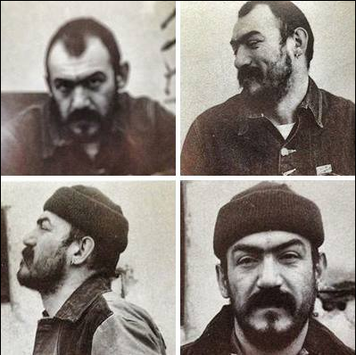


Live alla Festa dell'Unità Provinciale di Reggio Emilia, un giorno di settembre del 1996


Il concerto alla Festa Provinciale dell'Unità di Reggio Emilia del 1996 fu uno degli eventi più belli e memorabili per i Radiostars. Il giorno successivo, [la Gazzetta di Reggio pubblicò un articolo](/press/19960900-festa-unita/) firmato da Vincenzo Cavallarin, che raccontava la "cronaca" della serata.

Fino a quel momento avevamo suonato in diversi contesti reggiani e bolognesi, crescendo poco a poco nel seguito. Tuttavia, la Festa dell'Unità di Reggio rappresentava, in quegli anni, un palco di prestigio, grazie al vasto pubblico che attirava ogni anno.

Prima di noi si esibì un duo di ragazzi che proponeva cover dei Depeche Mode. Ci piacquero moltissimo, al punto che, chiusi nel piccolo camerino a lato del palco, iniziammo a preoccuparci: come avrebbe reagito il pubblico alla nostra musica scarna e graffiante, dopo un'esibizione così avvolgente e ricca di suoni elettronici?

Salimmo sul palco e, fin dai primi accordi, partì immediatamente un pogo selvaggio tra punk dalle creste variopinte, sia sotto che sopra al palco. Ma, dopo pochi minuti di musica, accadde ciò che rese quella serata memorabile.

Mentre cantavo vidi una persona dell'organizzazione della Festa percorrere la platea alla mia destra e dirigersi verso i camerini che, come ho già detto si trovavano lato palco. Un déjà-vu che, negli anni successivi, avrei vissuto più volte: ben due volte, infatti, le forze dell’ordine interruppero i nostri turbolenti concerti. Dopo poco, Andrea il nostro roadie, salì sul parco per informarci che dovevamo scendere e interrompere lo spettacolo (minuto 4:17 del video seguente).



Liberato il palco, Andrea prese il microfono e avvertì il pubblico: *«Attenzione abbiamo un annuncio del locale: non vogliono che si poghi altrimenti non permettono la prosecuzione del concerto!...»*

Sotto al palco, Marco Monney, armadio a due ante, dj radiofonico di Radio Antenna 1 e, dopo il concerto, nostro caro amico e fan, in piedi sotto al palco covava rabbia e rancore per l'annuncio. E fu così che per onorare il refrain della [sigla della sua trasmissione radiofonica](https://www.youtube.com/watch?v=PZvG7KcouE0), *«Monney delle galassie, per la giustizia vivi, voli per sconfiggere i cattivi»*, l'immenso Monney salì sul palco e, per sconfiggere i cattivi, si affaccio sul camerino per dare una bella strigliata al povero Cristo dell'organizzazione della Festa, mandato a fermare i punk scatenati. Un coro *«Monney! Monney!»* si levò dalla platea e fu così che gli organizzatori non poterono fare altro che far continuare il concerto, "the show must go on" e con annesso pogo, che ovviamente, divenne ancora più selvaggio.



Il giorno dopo Vincenzo Cavallarin scrisse per la Gazzetta:


*«..E FINALMENTE Reggio Emilia riuscì a partorire una nuova rock band. Uno di quei terzetti micidiali che una volta chiamato il fatidico quattro non li fermi più neanche staccandogli la spina. [...] Siamo sicuri che adesso i Radiostars siano la cosa migliore che “giri” nei circuiti musicali locali, con infinito risentimento per chi ha problemi con il rumore e i volumi fastidiosi.»*


Monney il super eroe con il suo cognome tatuato sulla pancia, che dopo quella serata ci seguì in molti concerti e ci ospitò svariate volte a Antenna 1, ci ha lasciò nel 2013: decisamente troppo presto. Ma noi lo ricordiamo spesso, con affetto e con un sorriso, in quel concerto dove salì sul palco e lottò per sconfiggere i cattivi che volevano fermare la nostra musica. Grazie Marco.



