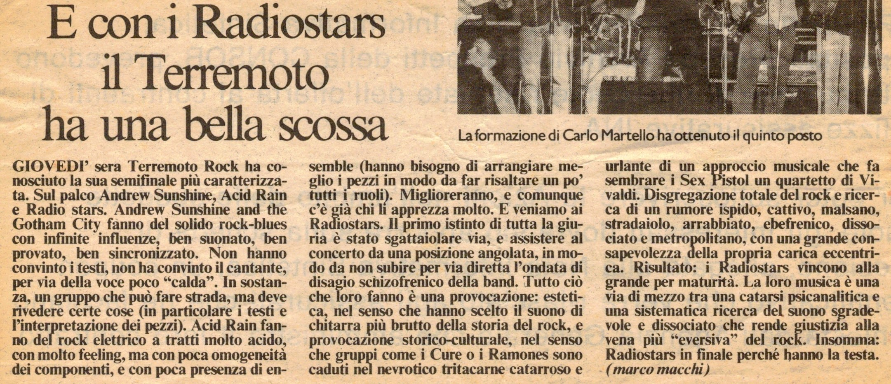

Articolo di Marco Macchi

**E con i Radiostars il Terremoto ha una bella scossa**

... E veniamo ai Radiostars. Il primo istinto di tutta la giuria è stato sgattaiolare via, e assistere al concerto da una posizione angolata, in modo da non subire per via diretta l’ondata di
disagio schizofrenico della band.
Tutto ciò che loro fanno è una provocazione: estetica, nel senso che hanno scelto il suono di chitarra più brutto della storia del rock, e provocazione storico-culturale, nel senso che gruppi come i Cure o i Ramones sono caduti nel nevrotico tritacarne catarroso e urlante di un approccio musicale che fa sembrare i Sex Pistol un quartetto di Vivaldi.
Disgregazione totale del rock e ricerca di un rumore ispido, cattivo, malsano, stradaiolo, arrabbiato, ebefrenico, dissociato e metropolitano, con una grande consapevolezza della propria carica eccentrica.
Risultato: i Radiostars vincono alla grande per maturità. La loro musica è una via di mezzo tra una catarsi psicanalitica e una sistematica ricerca del suono sgradevole e dissociato che rende giustizia alla vena più “eversiva” del rock.
Insomma: Radiostars in finale perché hanno la testa.
