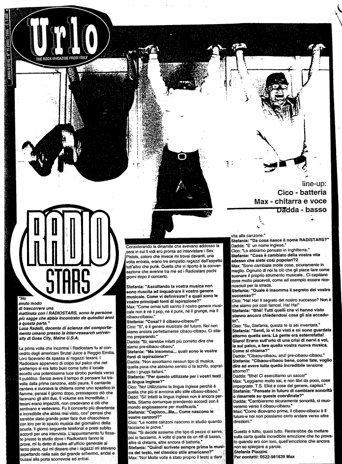

Intervista per l'audiorivista Urlo (Anno V, n.15)

"Ho avuto modo di trascorrere una mattinata con i RADIOSTARS, sono le persone più sagge che abbia incontrato da quindici anni a questa parte." (Luca Radelli, docente di scienza del comportamento umano presso la inter-research university di Goss City, Maine U.S.A.)

La prima volta che incontrai i Radiostars fu al concerto degli americani Brutal Juice è Reggio Emilia.
Loro facevano da spalla ai ragazzi texani. I Radiostars apparvero di colpo sul palco che nel frattempo si era fatto buio come tutto il locale eccetto una potentissima luce strobo puntata verso il pubblico. Senza avere il tempo di pensare fui travolta dalla prima canzone, ebbi paura. Il cantante cantava e suonava la chitarra come uno spastico in fiamme, pensai il giorno dopo, pressapoco ciò che facevano gli altri due. Il volume era incredibile, i texani erano impazziti, non credevano a ciò che sentivano e vedevano. Fu il concerto più divertente e incredibile che abbia mai visto, così pensai che sarebbe stato grande poter fare due chiacchiere con loro per lo spazio musica del giornalino della Scuola. Il giorno seguente telefonai e presi subito accordi per una intervista. L'appuntamento fu fissato presso lo studio dove i Radiostars fanno le prove, mi fu detto di salire all'ufficio generale al terzo piano, qui mi dissero che i ragazzi mi stavano aspettando nella sala del grande schermo, andai e bussai alla porta scorrevole ed entrai.

Considerando la dinamite che avevano addosso la sera in cui li vidi ero pronta ad intervistare i Sex
Pistols, coloro che invece mi trovai davanti, una volta entrata, erano tre simpatici ragazzi dall'aspetto tutt'altro che punk. Quella che vi riporto è la conversazione che avvenne tra me ed i Radiostars pochi giorni dopo il concerto.

**Stefania**: "Ascoltando la vostra musica non sono riuscita ad inquadrare il vostro genere
musicale. Come vi definireste? e quali sono le vostre principali fonti di ispirazione?"

**Max**: "Come ormai tutti sanno il nostro genere musicale non è ne il pop; ne il punk, ne il grunge, ma il cibaou-cibaou.”

**Stefania**: "Cosa!? il cibaou-cibaou?"

**Cico**: "*S*, è il genere musicale del futuro. Noi non siamo ancora perfettamente cibaou-cibaou. Ci stiamo preparando."

**Dadda**: “Si, sarebbe infatti più corretto dire che siamo pre-cibaou-cibaou”.

**Stefania**: "Ma insomma... quali sono le vostre fonti di ispirazione?"

**Dadda**: "Non ascoltiamo nessun tipo di musica, quella poca che abbiamo sentito ci fa schifo, soprat
tutto i gruppi italiani."

**Stefania**: "Per questo utilizzate per i vostri testi la lingua inglese?"

**Cico**: "No! Utilizziamo la lingua inglese perché è quella che più si avvicina allo stile cibaou-cibaou."

**Dadda**: "Sì Infatti la lingua inglese non è ancora perfetta. Stiamo comunque prendendo accordi con il mondo anglosassone per modificarla."

**Stefania**: “Capisco...Ma... Come nascono le vostre canzoni?”

**Cico**: “Le nostre canzoni nascono in studio quando facciamo le prove."

**Max**: "Si decide assieme che tipo di pezzo ci serve; poi lo facciamo. A volte si parte da un riff di basso, altre di chitarra, altre ancora di batteria."

**Stefania**: "Quindi scrivete sempre prima la musica del testo; nel classico stile americano?”

**Max**: "No, molte volte è stato proprio il testo a dare vita alla canzone.”

**Stefania**: "Da cosa nasce il nome RADISTARS?"

**Cico**: "Lo abbiamo pensato in Inghilterra."

**Stefania**: "Cosa è cambiato della vostra vita adesso che siete così popolari?

**Max**: "Sono cambiate molte cose, sicuramente in meglio. Ognuno di noi fa ciò che gli piace fare come suonare il proprio strumento musicale. Ci capitano cose molto piacevoli, come ad esempio essere riconosciuti per la strada.

**Stefania**: “Quale è insomma il segreto del vostro successo?”

**Cico**: "Ha! Ha! Il segreto del nostro successo? Non è che siamo poi così famosi. Ha! Ha!"

**Stefania**: “Bhè! Tutti quelli che vi hanno visto stanno ancora chiedendosi cosa gli sia accaduto”.

**Cico**: “Su, Stefania, questa te la sei inventata."

**Stefania**: “Senti; io vi ho visti e mi sono guardata attorno quella sera. La gente era esterrefatta! Giuro! Erano sull'orlo di una crisi di nervi e voi, la sul palco, a fare quella vostra nuova musica. Come si chiama?”

**Dadda**: “Cibaou-cibaou, anzi pre-cibaou-cibaou.”

**Stefania**: “Cibaou-cibaou bene, come fate, voglio dire ad avere tutta quella incredibile tensione
attorno?”

**Dadda**: “Bhè! Ci esercitiamo un sacco!”

**Max**: "Leggiamo molto sai, e non libri da poco, cose impegnate. T.S. Eliot e cose del genere, capisci”

**Stefania**: “Pensate in futuro di cambiare sonorità lo rimarrete su queste coordinate?”

**Dadda**: “Cambieremo sicuramente sonorità, ci muoveremo verso il cibaou-cibaou.”

**Max**: “Come dicevamo prima, il cibaou-cibaou è il futuro e noi non possiamo certo andare verso altre direzioni.”

Questo è tutto, quasi tutto. Resterebbe da mettere sulla carta quella incredibile emozione che ho provato quando ero con loro, quell'emozione che ancora non so spiegare a parole.

a cura di Stefania Piazzini per la rivista Urlo.
