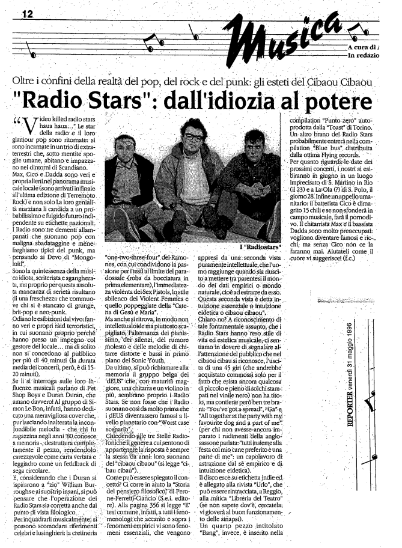

Intervista di F.C. per Reporter 31 maggio 1996

"Video killed the radiostars haua haua...." Le star della radio e il loro glamour pop sono ritornate: si sono incamate in un trio di extra-terrestri che, sotto mentite spoglie umane, abitano e impazzano nei dintorni di Scandiano. Max, Cico e Dadda sono veri e propri alieni nel panorama musicale locale (sono arrivati in finale all'ultima edizione di Terremoto Rock) non solo. La loro genità marziana li candida a un probabilissimo e fulgido futuro indipendente su etichette nazionali. I Radio sono tre dementi allampanati che suonano pop con maligna sbadataggine e menefreghismo tipici del punk, ma pensando ai Devo di “Mongoloid!
Sono la quintessenza delle musica idiota, scriteriata e sgangherata, ma proprio per questa assoluta mancanza di serietà risultano di una freschezza che commuove chi si è stancato di grunge, brit-pop e neo-punk.

Odiano le esibizioni dal vivo: fanno veri e propri raid terroristici, in cui suonano proprio perché hanno preso un impegno col gestore del locale... ma di solito non si concedono al pubblico per più di 40 minuti (la durata media dei concenti, però, è di 15-20 minuti).

Se li si interroga sulle loro influenze musicali parlano di Pet Shop Boys e Duran Duran, che
amano davvero! Al gruppo di Simon Le Bon, infatti, hanno dedicato una meravigliosa cover che,
pur lasciando inalterata la inconfondibile melodia - che chi fu ragazzina negli anni '80 conosce a memoria, destruttura completamente il pezzo, rendendolo carezzevole come carta vertata e
leggiadro come un feedback di sega circolare.

E, considerando che i Duran si ispiararono a "zio" William Burroghs e ai suoi trip insani,si può
pensare che l'operazione dei Radiostars sia corretta anche dal punto di vista filologico.

Per inquadrarli musicalmente si possonò scomodare riferimenti celebri e lusinghieri: la cretineria "one-two-three-four" dei Ramones, con cui condividono la passione per i testi al limite del paradossale (roba da bocciatura in prima elementare) l'immediatezza violenta del Sex Pistols, lo stile sbilenco dei Violent Femmes e quello poppeggiate della "Catena di Gesù e Maria".

Ma anche si ritrova, in modo non intellettualoide ma piuttosto scapigliato, l'alternanza del pianissimo, dei silenzi, del rumore molesto e delle melodie di chitarre distorte e bassi in primo piano dei Sonic Youth.

Da ultimo, si può richiamare alla memoria il gruppo belga dei"dEUS" che, con maturità maggiore, una chitarra e un violino in più, sembrano proprio i Radiostars. Se non fosse che i Radio suonano così da molto prima che i dEUS diventassero famosi a livello planetario con "Worst case scenario".

Chiedendo alle Stelle Radiofoniche il genere a cui si sentono di appartenere la risposta è sempre la stessa da anni: loro suonano del "cibaou cibaou" (si legge “cibau cibau").

Come può essere spiegato il concetto? Ci corre in aiuto la "Storia del pensiero filosofico" di Perone-Ferretti-Ciancio (S.e.i. Editore). Alla pagina 356 sì legge “È tesi comune, infatti, a tutti i fenomenologi che accanto e sopra i fenomeni empirici vi sono fenomeni essenziali, che vengono appresi da una seconda vista puramente intellettuale, che l'uomo raggiunge quando sia riuscito a mettere tra parentesi il mondo dei dati empirici o mondo naturale, cioè ad estrarre da esso. Questa seconda vista è detta intuizione essenziale o intuizione eidetica o cibaou cibaou"
Chiaro no? A riconoscimento di tale fondamentale assunto, che i Radiostars Hanno reso stile di
vita ed estetica musicale; ci sentiamo in dovere di segnalare all'attenzione del pubblico che nel cibaou cibaou si riconosce, l'uscita di una 45 giri (che andrebbe acquistato commossi solò per il fatto che esista ancora qualcosa di piccolo pieno di solchi stampati nel vinile nero) non ha titolo, ma contiene però ben tre brani: “You've gota spread", Ga" e "All together at the party with my favourite dog and a part of me" (per chi non avesse ancora imparato i rudimenti della anglosassone parlata:"tutti insieme alla festa col mio cane preferito e una parte di me": un capolavoro di astrazione dal sè empirico e di intuizione eidetica).

Il disco esce su etichetta indie ed è allegato alla rivista "Urlo", che può essere rintracciata, a Reggio, alla mitica "Libreria del Teatro" (Se non sapete dov'è, cercatela: vi gioverà al buon funzionamento delle sinapsi).

Un quarto pezzo intitolato "Bang", invece, è inserito nella compilation "Punto: zero" auto-prodotta dalla Toast di Torino.

Un altro brano dei Radiostars probabilmente entrerà nella compilation “Blu Bus” distribuita dalla ottima Flying Records.

Per quanto riguarda le date dei prossimi concerti, i nostri si esibiranno in giugno in un luogo
imprecisato di S. Martino in Rio (il 23) e a La-Ola di S.Polo, il giorno 28. Infine un appello umanitario: il batterista Cico è dimagrito 15 chili e se non sfonderà in campo musicale, farà il pornodivo. Il chitarrista Max e il bassista Dadda sono molto preoccupati vogliono diventare famosi e ricchi; ma senza Cico non ce la faranno mai. Aiutateli come il cuore vi suggerisce! (f.c.)

