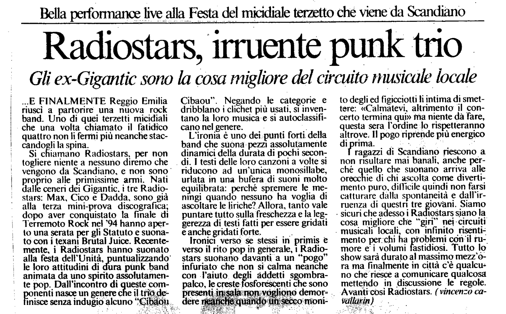

Riferimenti dell'articolo: es. autore rivista ecc.

..E FINALMENTE Reggio Emilia riuscì a partorire una nuova rock band. Uno di quei terzetti micidiali che una volta chiamato il fatidico quattro non li fermi più neanche staccandogli la spina.

Si chiamano Radiostars, per non togliere niente a nessuno diremo che vengono da Scandiano, e non sono proprio alle primissime armi. Nati dalle ceneri dei Gigantic, i tre Radiostars: Max, Cico e Dadda, sono già alla terza mini-prova discografica; dopo aver conquistato la finale di Terremoto Rock nel ’94 hanno aperto una serata per gli Statuto e suonato con i texani Brutal Juice. Recentemente, i Radiostars hanno suonato alla festa dell'Unità, puntualizzando le loro attitudini di dura punk band animata da uno spirito assolutamente pop. Dall'incontro di queste comnenti nasce un genere che il trio deinisce senza indugio alcuno “Cibaou-Cibaou”. Negando le categorie e dribblano i clichet più usati, si inventano la loro musica e si autoclassificano nel genere.

L'ironia è uno dei punti forti della band che suona: pezzi assolutamente dinamici della durata di pochi secondi. I testi delle loro canzoni a volte si riducono ad un'unica monosillabe, urlata in una bufera di suoni molto equilibrata: perché spremere le meningi quando nessuno ha voglia di
ascoltare le liriche? Allora, tanto vale puntare tutto sulla freschezza e la leggerezza di testi fatti per essere gridati e anche gridati forte. Ironici verso se stessi in primis e verso il rito pop in generale, I Radiostars suonano davanti a un “pogo” infuriato che non si calma neanche con l’aiuto degli addetti sgombrapalco, le creste fosforescenti che sono presenti in sala non vogliono demordere neanche quando un secco monito degli ex figiciotti li intima di smettere: «Calmatevi, altrimenti il concerto termina qui» ma niente da fare, questa sera l'ordine lo rispetteranno altrove. Il pogo riprende più energico diprima. I ragazzi di Scandiano riescono a non risultare mai banali, anche perché quello che suonano arriva alle orecchie di chi ascolta come divertimento puro, difficile quindi non farsi catturare dalla spontaneità e dall’irruenza di questi tre giovani. Siamo sicuri che adesso i Radiostars siano la cosa migliore che “giri” nei circuiti musicali locali, con infinito risentimento per chi ha problemi con il rumore e i volumi fastidiosi. Tutto lo show sarà durato al massimo mezz’ora ma finalmente in città c'è qualcuno che riesce a comunicare qualcosa mettendo in discussione le regole. Avanti così Radiostars.

Vincenzo Cavallarin
