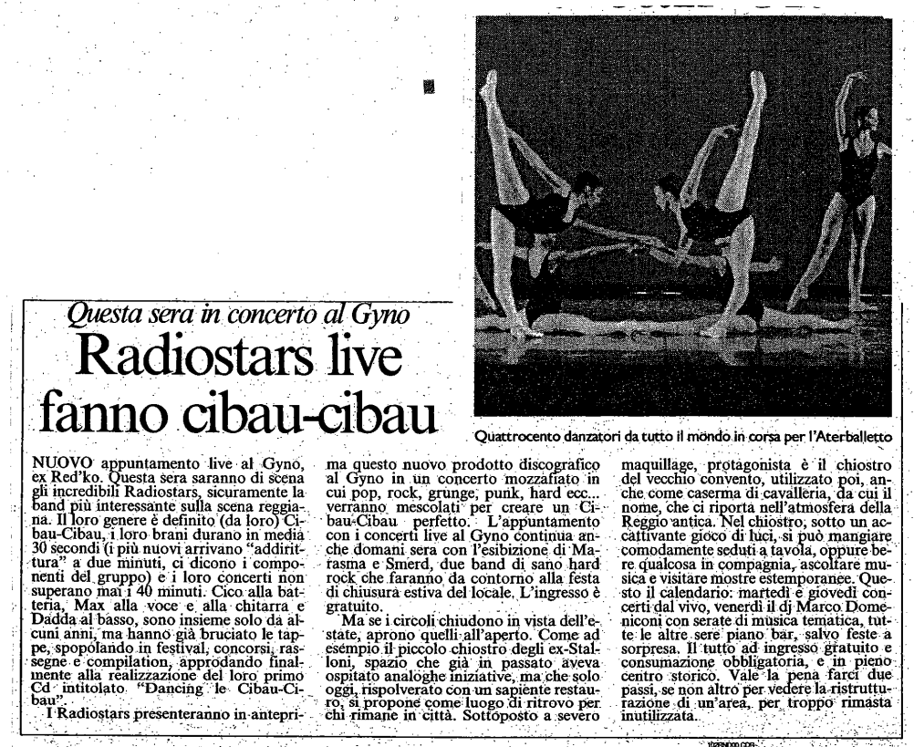

Articolo uscito sulla Gazzetta di Reggio il 14/06/1997.

Ecco la trascrizione fedele dell'articolo:

---

**NUOVO appuntamento live al Gyno, ex Red’ko.** Questa sera saranno di scena gli incredibili Radiostars, sicuramente la band più interessante sulla scena reggiana.

Il loro genere è definito (da loro) Cibaou-Cibaou, i loro brani durano in media 30 secondi (i più nuovi arrivano “addirittura” a due minuti, ci dicono i componenti del gruppo) e i loro concerti non superano mai i 40 minuti. Cico alla batteria, Max alla voce e alla chitarra e Dadda al basso, sono insieme solo da alcuni anni, ma hanno già bruciato le tappe, spopolando in festival, concorsi, rassegne e compilation, approdando finalmente alla realizzazione del loro primo CD intitolato *Dancing le Cibaou-Cibaou*.

I Radiostars presenteranno in anteprima questo nuovo prodotto discografico al Gyno in un concerto mozzafiato in cui pop, rock, grunge, punk, hard ecc… verranno mescolati per creare un Cibaou-Cibaou perfetto. 

L’appuntamento con i concerti live al Gyno continua anche domani sera con l’esibizione di Marasma e Smerd, due band di sano hard rock che faranno da contorno alla festa di chiusura estiva del locale. L’ingresso è gratuito. 

Ma se i circoli chiudono in vista dell’estate, aprono quelli all’aperto. Come ad esempio il piccolo chiostro degli ex-Stalloni, spazio che già in passato aveva ospitato analoghe iniziative, ma che solo oggi, rispolverato con un sapiente restauro, si ripropone come luogo di ritrovo per chi rimane in città. 

Sottoposto a severo maquillage, protagonista è il chiostro del vecchio convento, utilizzato poi anche come caserma di cavalleria, da cui il nome, che ci riporta nell’atmosfera della Reggio antica. 

Nel chiostro, sotto un accattivante gioco di luci, si può mangiare comodamente seduti a tavola, oppure bere qualcosa in compagnia, ascoltare musica e visitare mostre estemporanee. 

Questo il calendario: martedì e giovedì concerti dal vivo, venerdì dj Marco Domeniconi con serate di musica tematica, tutte le altre sere piano bar, salvo feste a sorpresa. Il tutto ad ingresso gratuito e consumazione obbligatoria, e in pieno centro storico. Vale la pena farci due passi, se non altro per vedere la ristrutturazione di un’area, per troppo rimasta inutilizzata.

