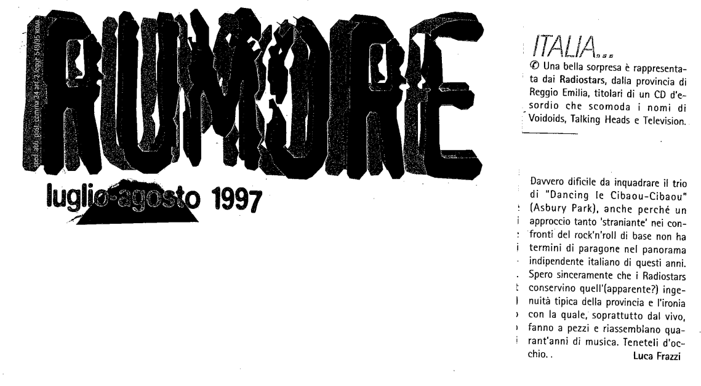

Recensione di Luca Frazzi per [Rumore](https://it.wikipedia.org/wiki/Rumore_(rivista)) agosto 1998

Una bella sorpresa è rappresentata dai Radiostars, della provincia di Reggio Emilia, titolari di un CD d'esordio che scomoda i nomi di Voidoids, Talking Heads e Television.

Davvero dificile da inquadrare il trio di "Dancing le Cibaou-Cibaou” (Asbury Park), anche perché un approccio tanto 'straniante' nei confronti del rock'n'roll di base non ha termini di paragone nel panorama indipendente italiano di questi anni. Spero sinceramente che i Radiostars conservino quell'(apparente?) ingenuità tipica della provincia e l'ironia con la quale, soprattutto dal vivo, fanno a pezzi e riassemblano quarant'anni di musica. Teneteli d'occhio.

