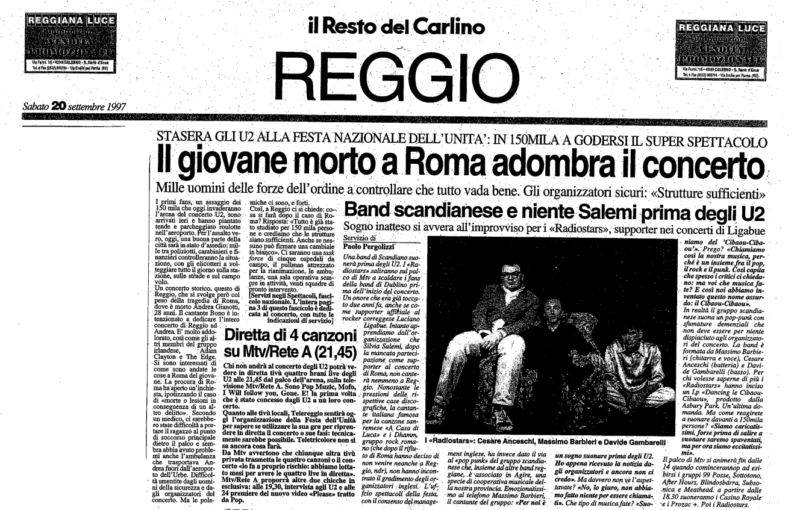

Prima pagina de Il Resto del Carlino Reggio - 20/09/1997. Di Paolo Pergolizzi

**Sogno inatteso si avvera all'improvviso per i «Radiostars», supporter nei concerti di Ligabue**

Una band di Scandiano suonerà prima degli U2. I «Radiostars» saliranno sul palco di Miv a scaldare i fans della band di Dublino prima dell'inizio del concerto.
Un onore che era già toccato due anni fa, anche se come supporter ufficiale al
rocker correggese Luciano Ligabue. Intanto apprendiamo dall'organizzazione che
Silvia Salemi, dopo la mancata partecipazione come supporter al concerto di Roma; non canterà nemmeno a Reggio. Nonostante ''le pressioni delle rispettive case discografiche, la cantante italiana famosa per la canzone sanremese «A Casa di Luca» e i Dhamm, gruppo rock romano (che dopo il rifiuto di Roma hanno deciso di non venire neanche a Reggio, ndr), non hanno incontrato il gradimento degli organizzatori - inglesi. L'ufficio spettacoli della festa con il consenso del manage
ment inglese, ha invece dato il via al «pop punk» del gruppo scandianese che insieme ad altre band reggiane, è associato in Agire, una specie di cooperativa musicale della nostra provincia. Emozionatissimo al telefono Massima Barbieri, il cantante del gruppo: «Per noi è un sogno suonare prima degli U2. Ho appena ricevuto la notizia dagli organizzatori e ancora non ci credo». Ma davvero non ve l’aspettavate? «No, lo giuro; non abbiamo fatto niente per essere chiamati». Che tipo di musica fate? «Suoniamo del Cibaou-Cibaou». Prego? «Chiamiamo così la nostra musica, perché è un insieme fra il pop, il rock e il punk. Così capita che spesso i critici ci chiedano: ma voi che musica fate? E così noi abbiamo inventato questo nome assurdo: il Cibaou-Cibaou».

In realtà il gruppo scandianese suona un pop-punk con sfumature demenziali che non deve essere per niente dispiaciuto agli organizzatori del concerto. La band è formata da Massimo Barbieri (chitarra e voce), Cesare Anceschi (batteria) e Davide Gambarelli (basso). Per chi volesse saperne di più i «Radiostars» hanno inciso un Lp «Dancing le Cibaou-Cibaou», prodotto dalla Asbury Park. Un'ultima domanda. Ma come reagirete a suonare davanti a 150mila persone? «Siamo carichissimi forse prima di salire a suonare saremo spaventati, ma per ora siamo eccitatissimi».

Il palco di Mtv si animerà fin dalle 14 quando cominceranno ad esibirsi i gruppi 99 Posse, Sottotono, After Hours; Blindosbdrra, Subsonica; e Megthead; a partire dalle 18.30 suoneranno i Casino Royale e i Prozac+ Poi i Radiostars.
