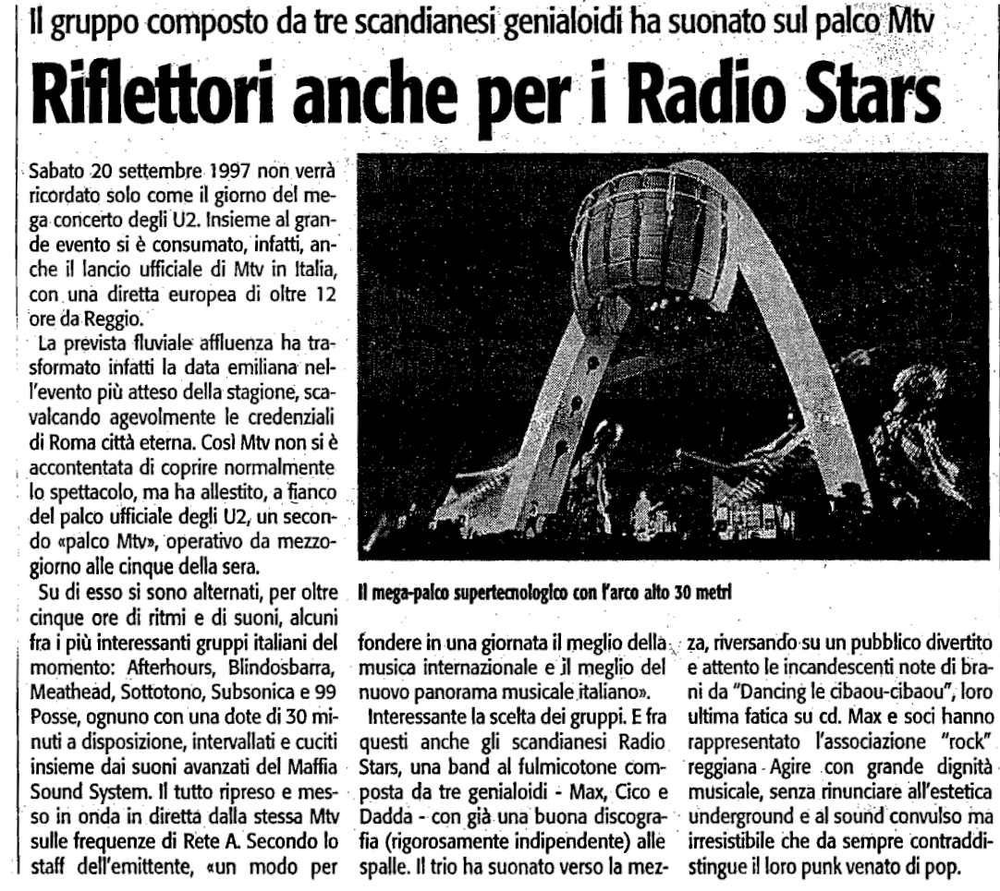

Articolo del quotidiano L'Unità

Sabato 20 settembre 1997 non verrà ricordato solo come il giorno del mega-concerto degli U2. Insieme al grande evento si è consumato, infatti, anche il lancio ufficiale di Mtv in Italia,
con una diretta europea di oltre 12 ore da Reggio.

La prevista fluviale affluenza ha trasformato infatti la data emiliana nell'evento più atteso della stagione, scavalcando agevolmente le credenziali di Roma città eterna. Così Mtv non si è
accontentata di coprire normalmente lo spettacolo, ma ha allestito, a fianco del palco ufficiale degli U2, un secondo «palco Mtv», operativo da mezzogiorno alle cinque della sera.

Su di esso si sono alternati, per oltre cinque ore di ritmi e di suoni, alcuni fra i più interessanti gruppi italiani del momento: Afterhours, Blindosbarra, Meathead, Sottotono, Subsonica e 99 Posse, ognuno con una dote di 30 minuti a disposizione, intervallati e cuciti
insieme dai suoni avanzati del Maffia Sound System. Il tutto ripreso e messo in onda in diretta dalla stessa Mtv sulle frequenze di Rete A. Secondo lo staff dell'emittente, «un modo per
fondere in una giornata il meglio della musica internazionale e il meglio del nuovo panorama musicale italiano».
Interessante la scelta dei gruppi. E fra questi anche gli scandianesi Radio Stars, una band al fulmicotone composta da tre genialoidi - Max, Cico e Dadda - con già una buona discografia (rigorosamente indipendente) alle spalle. Il trio ha suonato verso la mezaa, riversando-su un pubblico divertito e attento le incandescenti note di brani da “Dancing le cibaou-cibaou”, loro
ultima fatica su cd. Max e soci hanno rappresentato l'associazione “rock” reggiana - Agire con grande dignità musicale, senza rinunciare all'estetica underground e al sound convulso ma
irresistibile che da sempre contraddistingue il loro punk venato di pop.
