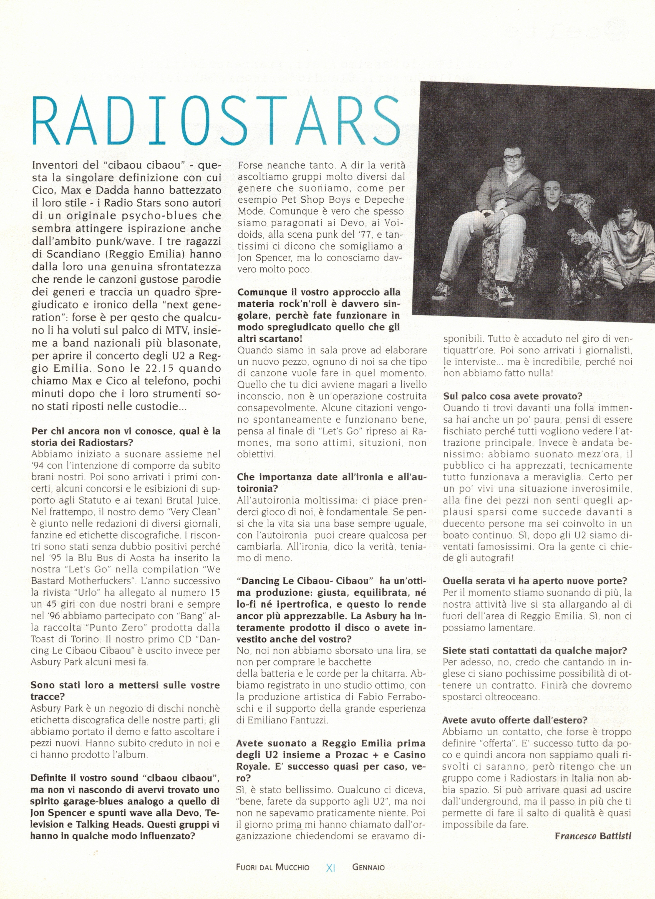
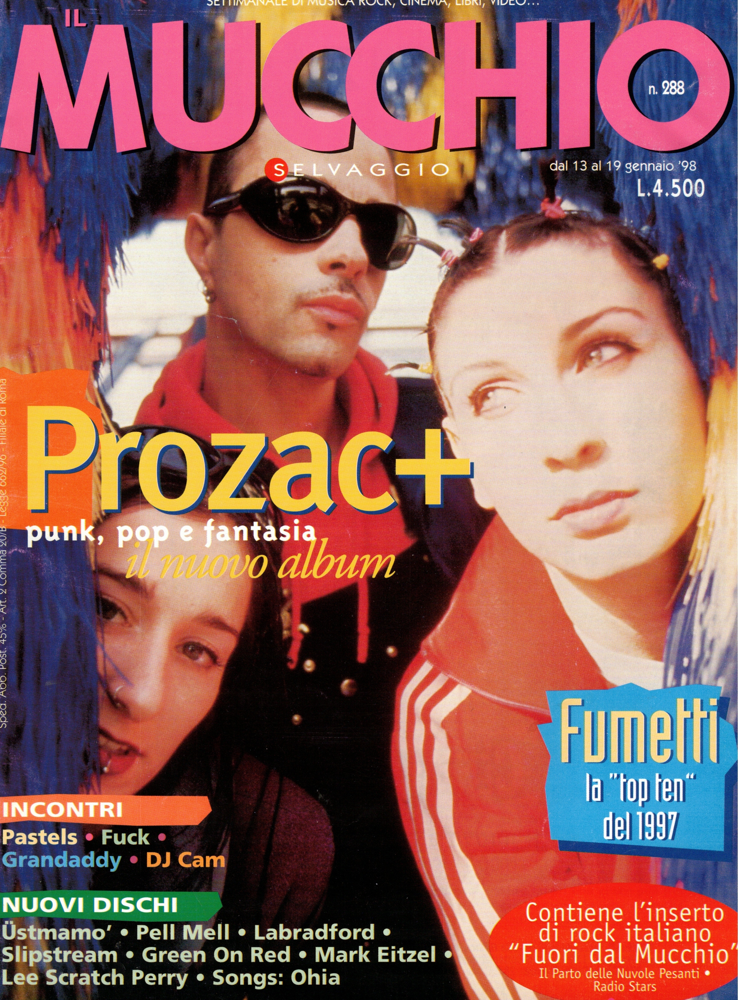

Articolo di Francesco Battisti da [Mucchio Selvaggio](https://it.wikipedia.org/wiki/Il_mucchio_selvaggio_(rivista)) n.288 gennaio 1998

Inventori del *cibaou cibaou* - questa la singolare definizione con cui Cico, Max e Dadda hanno battezzato il loro stile - i Radiostars sono autori di un originale psycho-blues che sembra attingere ispirazione anche dall'ambito punk/wave. I tre ragazzi di Scandiano (Reggio Emilia) hanno dalla loro una genuina sfrontatezza che rende le canzoni gustose parodie dei generi e traccia un quadro spregiudicato e ironico della “next generation”: forse è per questo che qualcuno li ha voluti sul palco di MTV, insieme a band nazionali più blasonate, per aprire il concerto degli U2 a Reggio Emilia. Sono le 22.15 quando chiamo Max e Cico al telefono, pochi minuti dopo che i loro strumenti sono stati riposti nelle custodie.

**Per chi ancora non vi conosce, qual è la storia dei Radiostars?**

Abbiamo iniziato a suonare assieme nel ‘94 con l'intenzione di comporre da subito brani nostri. Poi sono arrivati i primi concerti, alcuni concorsi e le esibizioni di supporto agli Statuto e ai texani Brutal Juice. Nel frattempo, il nostro demo *Very Clean* è giunto nelle redazioni di diversi giornali,
fanzine ed etichette discografiche. I riscontri sono stati senza dubbio positivi perché nel ‘95 la Blu Bus di Aosta ha inserito la nostra “Let's Go" nella compilation "We Bastard Motherfuckers". L'anno successivo la rivista “Urlo" ha allegato al numero 15 un 45 giri con due nostri brani e sempre
nel ‘96 abbiamo partecipato con “Bang” alla raccolta “Punto Zero" prodotta dalla Toast di Torino, Il nostro primo CD *Dancing Le Cibaou Cibaou* è uscito invece per
Asbury Park alcuni mesi fa.

**Sono stati loro a mettersi sulle vostre tracce?**

Asbury Park è un negozio di dischi nonché etichetta discografica delle nostre parti; gli abbiamo portato il demo e fatto ascoltare i pezzi nuovi. Hanno subito creduto in noi e ci hanno prodotto l'album.

**Definite ll vostro sound “cibaou cibaou”, ma non vi nascondo di avervi trovato uno spirito garage-blues analogo a quello di Jon Spencer e spunti wave alla Devo, Television e Talking Heads. Questi gruppi vi hanno in qualche modo influenzato?**

Forse neanche tanto. A dir la verità ascoltiamo gruppi molto diversi dal genere che suoniamo, come per
esempio Pet Shop Boys e Depeche Mode. Comunque è vero che spesso siamo paragonati ai Devo, ai Voidoids, alla scena punk del ‘77, e tantissimi ci dicono che somigliamo a Jon Spencer, ma lo conosciamo davvero molto poco.

**Comunque il vostro approccio alla materia rock'n'roll è davvero singolare, perchè fate funzionare in modo spregiudicato quello che gli altri scartano!**

Quando siamo in sala prove ad elaborare un nuovo pezzo, ognuno di noi sa che tipo di canzone vuole fare in quel momento. Quello che tu dici avviene magari a livello inconscio, non è un'operazione costruita consapevolmente. Alcune citazioni vengono spontaneamente e funzionano bene, pensa al finale di “Let's Go” ripreso ai Ramones. ma sono attimi, situazioni, non obiettivi.

**Che importanza date all'ironia e all'autoironia?**

All'autoironia moltissima: ci piace prenderci gioco di noi, è fondamentale. Se pensi che la vita sia una base sempre uguale, con l'autoironia puoi creare qualcosa per cambiarla. All'ironia, dico la verità, teniamo di meno.

**“Dancing Le Clbaou- Cibaou” ha un'ottima produzione: giusta, equilibrata, né lo-fi né Ipertrofica, e questo lo rende ancor più apprezzabile. La Asbury ha interamente prodotto il disco o avete investito anche del vostro?**

No, noi non abbiamo sborsato una lira, se non per comprare le bacchette della batteria e le corde per la chitarra. Abbiamo registrato in uno studio ottimo, con la produzione artistica di Fabio Ferraboschi e il supporto della grande esperienza di Emiliano Fantuzzi.

**Avete suonato a Reggio Emilia prima degli U2 insieme a Prozac + e Casino Royale. È successo quasi per caso, vero?**

Sì, è stato bellissimo. Qualcuno ci diceva, "bene, farete da supporto agli U2”, ma noi
non ne sapevamo praticamente niente. Poi il giorno prima mi hanno chiamato dall'organizzazione chiedendomi se eravamo disponibili. Tutto è accaduto nel giro di ventiquattrore. Poi sono arrivati i giornalisti, le interviste... ma è incredibile, perché noinon abbiamo fatto nulla!

**Sul palco cosa avete provato?**

Quando ti trovi davanti una folla immensa hai anche un po' paura, pensi di essere fischiato perché tutti vogliono vedere l'attrazione principale. Invece è andata benissimo: abbiamo suonato mezz'ora, il
pubblico ci ha apprezzati, tecnicamente tutto funzionava a meraviglia. Certo per un po' vivi una situazione inverosimile, alla fine dei pezzi non senti quegli applausi sparsi come succede davanti a
duecento persone ma sei coinvolto in un boato continuo. Sì, dopo gli U2 siamo diventati famosissimi. Ora la gente ci chiede gli autografi!

**Quella serata vi ha aperto nuove porte?**

Per il momento stiamo suonando di più, la nostra attività live si sta allargando al di fuori dell'area di Reggio Emilia. Sì, non ci possiamo lamentare.

**Siete stati contattati da qualche major?**

Per adesso, no, credo che cantando in inglese ci siano pochissime possibilità di ottenere un contratto. Finirà che dovremo spostarci oltreoceano.

**Avete avuto offerte dall'estero?**
Abbiamo un contatto, che forse è troppo definire “offerta”. E' successo tutto da poco e quindi ancora non sappiamo quali risvolti ci saranno, però ritengo che un gruppo come i Radiostars in Italia non abbia spazio. Si può arrivare quasi ad uscire dall'underground, ma il passo in più che ti permette di fare il salto di qualità è quasi impossibile da fare.

