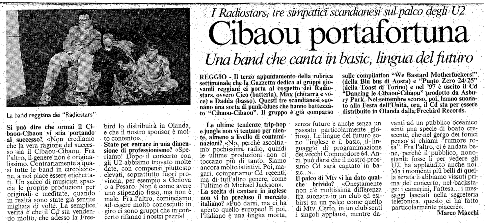

Articolo di Marco Macchi per la Gazzetta di Reggio, 4 maggio 1998

REGGIO - Il terzo appuntamento- della rubrica settimanale che la Gazzetta dedica ai gruppi giovanili reggiani ci porta al cospetto dei Radiostars, ovvero Cico (batteria), Max (chitarra e voce) e Dadda (basso). Questi tre scandianesi suonano una sorta di punk-blues che hanno battezzato “Cibaou-Cibaou”. Il gruppo è già comparso sulle compilation "We bastard Motherfuckers!" (della Blu Bus di Aosta) e "Punto zsero 24/25" (della Toast di Torino) nel '97 è uscito il Cd "Dancing le Cibaou-Cibaou" prodotto da Aspury Park. Nel settembre scorso, poi, hanno suonato alla Festa dell'Unità, ora, il CD sta per essere distribuito in Olanda dalla Freebird Records.

**Si può dire che ormai il Cibaou-Cibaou vi stia portando al successo?** «Non crediamo che la vera ragione del successo sia il Cibaou-Cibaou. Fra l’altro, il genere non è originalissimo. Contrariamente a quasi tutte le band in circolazione, a noi piace essere etichettati. Un sacco di musicisti spaccia le proprie produzioni per originali e meditate, quando in realtà sono state già sentite migliaia di volte. La semplice verità è che il Cd sta vendendo .molto, che adesso la Freebird lo distribuirà in Olanda, e che il nostro sponsor è molto contento».

**State per entrare in una dimensione di professionismo?** «Speriamo! Dopo il concerto con gli U2 abbiamo trovato molte date, con compensi piuttosto elevati, soprattutto fuori provincia, per esempio a Genova o a Pesaro. Non è come avere uno stipendio fisso, ma non è male. Fra l’altro, cominciamo ad essere molto conosciuti: in giro ci sono gruppi che in concerto rifanno i nostri pezzi»!

**Le ultime tendenze trip-hop e jungle non vi tentano per niente; almeno a livello di contaminazioni?** «No, perché ascoltiamo pochissima radio, quindi le ultime produzioni non ci
toccano più di tanto. Siamo ancora molto istintivi. Poi, magari, comperiamo Cd recenti, ma di tutt’altro genere, come l’ultimo di Michael Jackson».

**La scelta di cantare in inglese non vi ha precluso il mercato italiano?** «Può darsi, ma ci ha aperto quello europeo! E poi, l’italiano è una lingua morta, senza futuro e anche senza un
passato particolarmente glorioso. Le lingue del futuro sono l’inglese e il basic, il linguaggio di programmazione dei vecchi Commodore 64. Anzi, può darsi che il nostro prossimo Cd sarà cantato in basic..... "

**Il palco di Mtv vi ha dato qualche brivido?** «Onestamente non c’è moltissima differenza
fra suonare in un club ed esibirsi su un palco come quello di Mtv. Certo, in un club senti
i singoli applausi, mentre davanti ad un pubblico oceanico senti una specie di boato crescente, che nel gergo dei fonici penso si chiami “rumore rosa”. Fra l’altro, ci è andata bene, perché il pubblico, nonostante fosse lì per vedere gli U2, ha applaudito anche noi. Ma i momenti più belli di quella serata li abbiamo vissuti prima: del concerto, nel backstage: i camerini, l'attesa... i messaggi lasciati nella segreteria telefonica, questo ci ha fatto particolarmente piacere».

Marco Macchi

