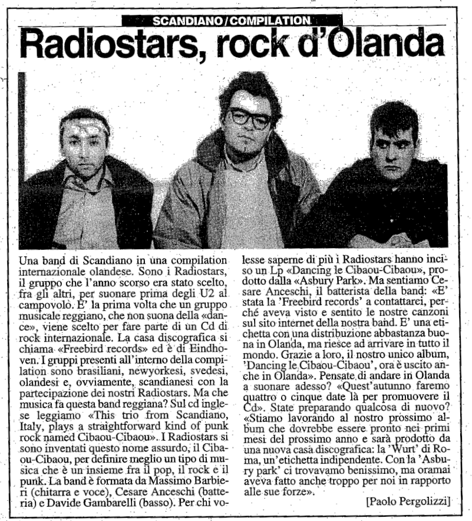

Articolo di Paolo Pergolizzi per il Resto del Carlino del 13 settembre 1998

Una band di Scandiano in una compilation internazionale olandese. Sono i Radiostars, il gruppo che l’anno scorso era stato scelto, fra gli altri, per suonare prima degli U2 al campovolo. È la prima volta che un gruppo musicale reggiano, che non suona della «dance», viene scelto per fare parte di un Cd di rock internazionale. La casa discografica si chiama. «Freebird records» ed è di Eindhoven. I gruppi presenti all’interno della compilation sono brasiliani, newyorkesi, svedesi, olandesi e, ovviamente, scandianesi con la partecipazione dei nostri Radiostars. Ma che
musica fa questa band reggiana? Sul cd inglese leggiamo «This trio from Scandiano, Italy, plays a straightforward kind of punk rock named Cibaou-Cibaou».. I Radiostars si sono inventati questo nome assurdo, il Cibaou-Cibaou, per definire meglio un tipo di musica che è un'insieme fra il pop, il rock è il punk. La band è formata da Massimo Barbieri (chitarra e voce), Cesare Anceschi (batteria) e Davide Gambarelli (basso). Per chi volesse saperne di più I Radiosfars hanno inciso un Lp «Dancing le Cibaou-Cibaou», prodotto dalla «Asbury Park». Ma sentiamo Cesare Anceschi, il batterista della band: «È stata la "Freebird records" a contattarci, perché aveva visto e sentito le nostre canzoni sul sito internet della nostra band. È una etichetta con una distribuzione abbastanza buona in Olanda, ma riesce ad arrivare in tutto il mondo. Grazie a loro, il nostro unico album, "Dancing le Cibaou-Cibaou", ora è uscito anche in Olanda». Pensate, di andare in Olanda a suonare adesso? «Quest’autunno faremo quattro o cinque date là per promuovere il cd». State preparando qualcosa di nuovo? «Stiamo lavorando al nostro prossimo album che dovrebbe essere. pronto nei primi mesi del prossimo anno e sarà prodotto da una nuova casa discografica: la "Vurt” di Roma, un'etichetta indipendente. Conta "Asbury park” ci trovavamo benissimo, ma oramai aveva fatto anche troppo per noi in rapporto alle sue forze».

Paolo Pergolizzi
