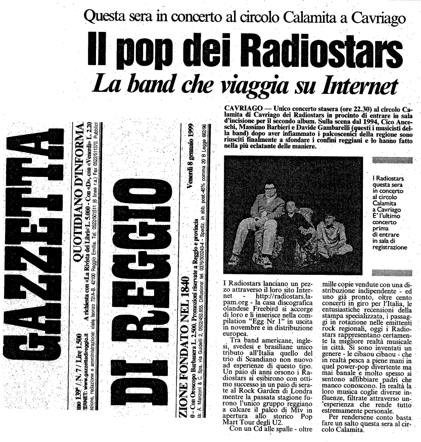

Articolo della Gazzetta di Reggio di venerdì 8 gennaio 1999

CAVRIAGO — Unico concerto stasera (ore 22.30) al circolo Calamita di Cavriago dei Radiostars in procinto di entrare in sala d’incisione per îl secondo album. Sulla scena dal 1994, Cico Anceschi, Massimo Barbieri e Davide Gambarelli (questi i musicisti della band) dopo aver infiammato i palcoscenici della regione sono riusciti finalmente a sfondare i confini reggiani e lo hanno fatto nella più eclatante delle maniere.

I Radiostars lanciano un pezzo attraverso il loro sito Internet - httpi//radiostars.la-
pam.org - la casa discografica olandese. Freebird si accorge di loro e li inserisce nella compilation “Egg-Nr.1” in uscita in novembre e in distribuzione europea.

Tra band americane, inglesi, svedesi e brasiliane unico tributo all’Italia quello del trio di Scandiano non nuovo ad esperienze di questo tipo.
Un paio di anni orsono i Radiostars si esibirono con ottimo successo in un paio di serate al Rock Garden di Londra mentre la passata stagione furono l’unico gruppo reggiano a calcare il palco di Mtv in apertura allo storico Pop Mart Tour degli U2.

Con un Cd alle spalle - oltre mille copie vendute con una distribuzione indipendente - ed
uno già pronto, oltre cento concerti in giro per l’Italia, le entusiastiche recensioni della
stampa specializzata, i passaggi in rotazione nelle emittenti rock regionali, oggi i Radiostars rappresentano certamente la migliore realtà musicale in città. Si sono inventati un genere - le cibaou cibaou - che in realtà pesca a piene mani in quel power-pop divertente ma mai banale e molto spesso si sentono affibbiare padri che manco conoscono. In realtà la loro musica coglie diverse influenze, filtrate attraverso un ‘esperienza’ che rende tutto estremamente personale.

Per rendersene conto basta fare un salto questa sera al circolo Calamita.
