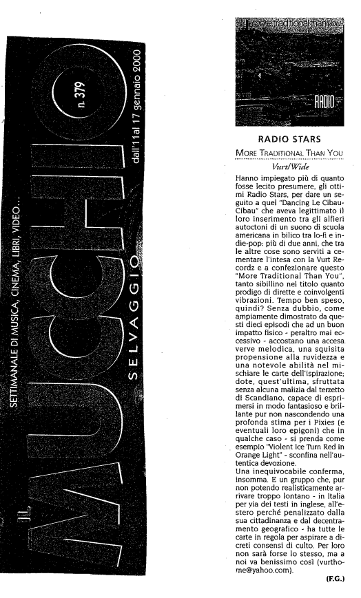

Recensione di More Traditional Than You a cura di F.G. per Mucchio Selvaggio num.379

Hanno impiegato più di quanto fosse lecito presumere, gli ottimi Radio Stars, per dare un seguito a quel "Dancing Le Cibau-Cibau” che aveva legittimato il loro inserimento tra gli alfieri autoctoni di un suono di scuola americana in bilico tra lo-fi e indie-pop: più di due anni, che tra le altre cose sono serviti a cementare l'intesa con la Vurt Recordz e a confezionare questo “More Traditional Than You", tanto sibillino nel titolo quanto prodigo di dirette e coinvolgenti vibrazioni. Tempo ben speso, quindi? Senza dubbio, come ampiamente dimostrato da questi dieci episodi che ad un buon impatto fisico - peraltro mai eccessivo - accostano una accesa verve melodica, una squisita propensione alla ruvidezza e una notevole abilità nel mischiare le carte dell’ispirazione; dote, quest'ultima, sfruttata senza alcuna malizia dal terzetto di Scandiano, capace di esprimersi in modo fantasioso e brillante pur non nascondendo una profonda stima per i Pixies (e eventuali loro epigoni) che in qualche caso - si prenda come esempio "Violent Ice Turn Red in Orange Light" - sconfina nell'autentica devozione.
Una inequivocabile conferma, insomma. E un gruppo che, pur non potendo realisticamente arrivare troppo lontano - in Italia per via dei testi in inglese, all'estero perché penalizzato dalla
sua cittadinanza e dal decentramento geografico - ha tutte le carte in regola per aspirare a discreti consensi di culto. Per loro non sarà forse lo stesso, ma a noi va benissimo così (vurthome@yahoo.com).

(F.G.)
