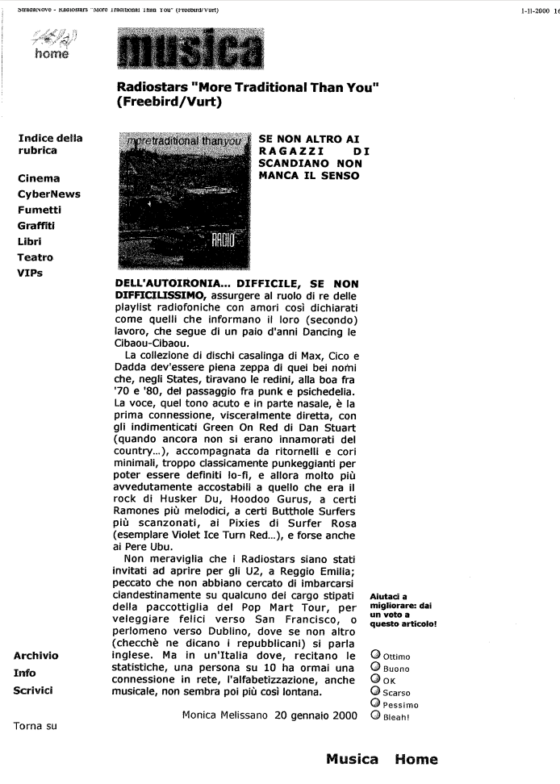

Riferimenti dell'articolo: es. autore rivista ecc.

SE NON ALTRO AI RAGAZZI NON MANCA IL SENSO DELL'AUTOIRONIA... DIFFICILE, SE NON DIFFICILISSIMO, assurgere al ruolo di re delle playlist radiofoniche con amori così dichiarati come quelli che informano il loro (secondo) lavoro, che segue di un paio d'anni Dancing le Cibaou-Cibaou.

La collezione di dischi casalinga di Max, Cico e Dadda dev'essere piena zeppa di quei bei nomi
che, negli States, tiravano le redini, alla boa fra '70 e '80, del passaggio fra punk e psichedelia. La voce, quel tono acuto e in parte nasale, è la prima connessione, visceralmente diretta, con gli indimenticati Green On Red di Dan Stuart (quando ancora non si erano innamorati del country...), accompagnata da ritornelli e cori minimali, troppo classicamente punkeggianti per poter essere definiti lo-fi, e allora molto più avvedutamente accostabili a quello che era il rock di Husker Du, Hoodoo Gurus, a certi Ramones più melodici, a certi Butthole Surfers
più scanzonati, ai Pixies di Surfer Rosa (esemplare Violet Ice Turn Red...), e forse anche
ai Pere Ubu.

Non meraviglia che i Radiostars siano stati invitati ad aprire per gli U2, a Reggio Emilia;
peccato che non abbiano cercato di imbarcarsi clandestinamente su qualcuno dei cargo stipati
della paccottiglia del Pop Mart Tour, per veleggiare felici verso San Francisco, o perlomeno verso Dublino, dove se non altro (checchè ne dicano i repubblicani) si parla inglese. Ma in un'Italia dove, recitano le statistiche, una persona su 10 ha ormai una connessione in rete, l'alfabetizzazione, anche musicale, non sembra poi più così lontana.
