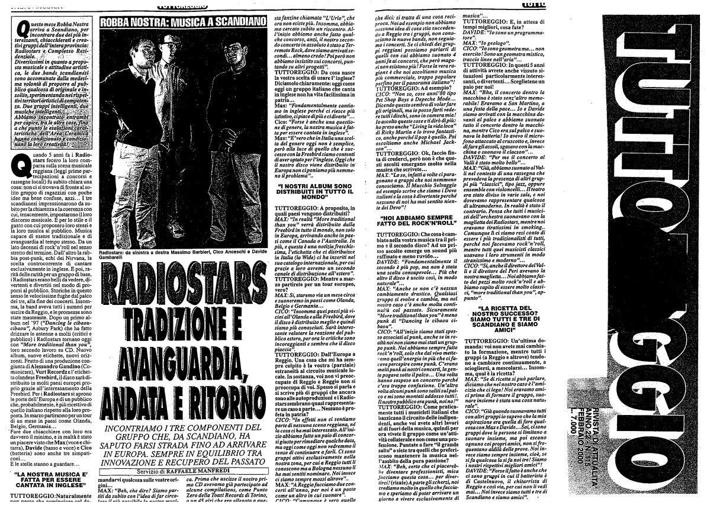

Intervista di Raffaele Manfredi per Tutto Reggio, Febbraio 2000

Questo mese Robba Nostra per incontrare due dei più interessanti, chiacchierati e creativi gruppi dell'intera provincia: Radiostars e Complesso Residenziale. DIversissimi in quanto proposta musicale e attitudine artistica, le due bands sono accomunante dalla medesima volontà di proporre al pubblico qualcosa di originale e insolito, sperimentando nei rispettivi territori artistici ci competenza. Abbiamo incontrato entrambi per capire tra le altre cose, fino a che punto le esalazioni caratteristiche dell'area ceramica hanno condizionato la loro creatività.

Quando 5 anni fa i Radiostars fecero la loro comparsa sulla scena musicale reggiana (leggi prime partecipazioni a concorsi e rassegne locali) fu subito chiara una cosa: non ci si trovava di fronte al solito gruppo di ragazzini con poche idee ma bene confuse, anzi... I tre scandianesi impressionarono da subito perla chiarezza e la coerenza con cui, tenacemente, impostarono il loro discorso musicale. E per lo stile e il gusto con cui proposero loro stessi e la loro musica al pubblico. Musica capace di essere tradizionale e di avanguardia al tempo stesso. Da un lato decenni di rock'n'roll nel senso stretto del termine. Dall'altro la rabbia post-punk, echi dei Nirvana, la scelta controcorrente di cantare esclusivamente in inglese. E poi, rarità delle rarità per un gruppo di base, i Radiostars erano belli da vedere, divertenti e divertiti nel modo di proporsi al pubblico. Storiche in questo senso le velocissime fughe dal palco dei tre, alla fine dei concerti. Insomma, la band aveva tutti i numeri per uscire da Reggio, e le promesse sono state mantenute. Dopo un primo album nel '97 (“Dancing le cibaou-cibaou”, Asbury Park) che ha fatto drizzare le antenne a molti (critici e pubblico) i Radiostars tornano oggi
con “More traditional than you”, loro secondo lavoro su CD. Nuovo album, nuove etichette, nuovi orizzonti. Frutto di una produzione congiunta di Alessandro Gandino (Comunicare), Vurt Recordz e l'etichetta olandese Freebird, il disco sarà distribuito in molti paesi europei proprio grazie all'interessamento della Freebird. Per i Radiostars si aprono le porte dell'Europa e di un pubblico che, probabilmente, è più ricettivo di quello italiano rispetto alla loro proposta. In marzo partiranno per un tour di un mese in paesi come Olanda, Belgio, Germania...
Fare due chiacchiere con loro era davvero il minimo, e in realtà è stato unpiacere vistoche Max (voce e chitarra), Davide (basso e voce) e Cico (batteria) sono anche tre simpaticoni...

E le stelle stanno a guardare...

"LA NOSTRA MUSICA È FATTA PER ESSERE CANTATA IN INGLESE"

TUTTOREGGIO: Naturalmente non cosso che cominciare col domandarvi qualcosa sulle vostre origini...

MAX: "Bhe,che dire? Siamo partiti da subito con l'idea di far circolare il possibile la nostra musica. Prima che uscisse il nostro primo CD avevamo già partecipato ad alcune compilations, come Punto Zero della Toast Records di Torino e un 45 giri che era allegato a nn d& oîri che era allegato a questa fanzine chiamata "Urlo", che ora non esiste più. Insomma, abbiaino cercato subito un riscontro. All’inizio abbiamo anche fatto qualche concorso, anzi, il nostro secondo concerto in assoluto è stato a Terremoto Rock, dove siamo arrivati secondi... almeno credo! Poi però non abbiamo insistito sui concorsi, puntando su altri progetti”.

TUTTOREGGIO: Da cosa nasce la vostra scelta di usare l’inglese? Diciamolo chiaramente: oggi come
oggi un gruppo italiano che canta in inglese non ha vita facilissima in patria...

Max: “Fondamentalmente cantiamo în inglese perché ci riesce più istintivo, ci piace di più e ci diverte”.

Cico: “Forse è anche una questione di genere, la nostra musica è fatta per essere cantata in inglese

Max: “È vero che in Italia una scelta del genere oggi non è semplice, però alla luce di quello che è successo con la Freebird siamo contenti di aver optato per l’inglese. Oggi che il nostro disco viene distribuito in Europa non ci poniamo più nemmeno il problema”.

"I NOSTRI ALBUM SONO DISTRIBUITI IN TUTTO IL MONDO”

TUTTOREGGIO: A proposito, in quali paesi vengono distribuiti?

MAX: “In realtà “More traditional than you” verrà distribuito dalla Freebird in tutto il mondo, non solo in Europa, arrivando anche in paesi come il Canada o l'Australia. In più, e questa è una notizia freschissima, l'etichetta che ci distribuisce in Italia (la Wide) ci ha inseriti nel
suo catalogo internazionale, per cui grazie a loro avremo un secondo canale di distribuzione all’estero”.

TUTTOREGGIO: Mentre a marzo partirete per un tour europeo, vero?

MAX: Si, staremo via un mese circa e suoneremo in paesi come Olanda, Belgio e Germania...

CICO: “Insomma quei paesi vicini all’Olanda e alla Freebird, dove il disco è distribuito meglio e quindi siamo più conosciuti. Sarà interessante valutare la reazione del pubblico estero, per ora le critiche sono incoraggianti e sembra che il disco piaccia”.

TUTTOREGGIO: Dall’Europa a Reggio. Una cosa che mi ha sempre colpito è la vostra (parziale)
estraneità al circuito musicale. In sostanza, voi non vi preoccupate di Reggio e Reggio non si
preoccupa di voi. Spesso si parla e si scrive più di gruppi che ancora sono alle autoproduzioni e i Radiostars sembrano quasi rappresentare un caso a parte... Nessuno è profeta in patria?

CICO: “In effetti non ci sentiamo parte di nessuna scena reggiana, né la cosa ci ha mai interessato. All’inizio abbiamo fatto un paio di concorsi giusto per rimediare qualche data,
ma oggi come oggi non vedremmo il senso di continuare a farli. Ci sono gruppi attivi esclusivamente nella nostra zona, per cui a Reggio tutti li conoscono ma a Bologna nessuno li
ha mai sentiti nominare. Noi invece ci siamo sempre mossi altrove”...

MAX: “A Reggio facciamo due concerti all'anno, per noi è un posto come un altro in cui suonare”.

CICO: “Comunque è vero quello che dici: si tratta di una cosa reciproca. Noi ad esempio non abbiamo nessuna idea di cosa stia succedendo a Reggio tra i gruppi, non conosciamo le nuove bands, non seguiamo i concerti. Se ci chiedi dei gruppi reggiani possiamo parlarti di
quelli con cui abbiamo suonato 4 anni fa ai concorsi, che però magari non esistono più! Forse la vera ragione è che noi ascoltiamo musica più commerciale, troppo popolare perfino per il panorama italiano”!

TUTTOREGGIO: Ad esempio?

CICO: “Non so, cose anni’80 tipo Pet Shop Boys o Depeche Mode... Dicendo questo sembra di voler fare gli originali, ma io posso farti vedere tutti i dischi, sono in camera mia! Io ascolto queste cose e ti dirò di più ho preso anche “Living la vida loca" di Ricky Martin e lo trovo fantastico, anche perché il pop è quello. Poi ascoltiamo anche Michael Jackson”...

TUTTOREGGIO; Ok, faccio finta di crederci, però non è che questi ascolti emergano molto nella
musica che scrivete...

MAX: “Lo so, infatti a volte ci paragonano a gruppi che noi nemmeno conosciamo. Il Mucchio Selvaggio ad esempio scrive che siamo i Devo italiani e la cosa è divertente perché nessuno di noi ha mai sentito niente dei Devo”!

“NOI ABBIAMO SEMPRE FATTO DEL ROCK’N'ROLL”

TUTTOREGGIO: Che cosa è cambiato nella vostra musica tra il primo e il secondo disco? Ad un primo ascolto emerge un sound più raffinato e meno ruvido...

DAVIDE: “Fondamentalmente il secondo è più pop, ma non è stata una scelta consapevole... Più che altra il disco è uscito così, in modo naturale”...

MAX: “Anche se non c'è nessun cambiamento drastico. Qualsiasi gruppo si evolve e cambia, ma nel
nostro caso c'è anche molta continuità col passato. Sicuramente “More traditionalthan you” è meno punk di “Dancing le cibaou cibaou”.

CICO: “All’inizio siamo stati spesso associati al punk, anche se in realtà noi non siamo mai stati un gruppo punk. Noi abbiamo sempre fatto rock'n'roll, solo che dal vivo mettevamo quell’energia in più che ci faceva percepire come punk. C'erano molti punk ai nostri concerti, la gente pogava sotto il palco... Una volta hanno sospeso un concerto perché c'era troppa confusione. Un'altra volta alcuni punk sono saliti sul palco e mi sono montati addosso tutti!
Il nostro pubblico era punk, noi no!”

TUTTOREGGIO: Come praticamente tutti i musicisti italiani che bazzicano il circuito delle indipendenti, anche voi avete altri lavori al di fuori della musica, quindi per ora vivete il gruppo come un’attività collaterale e non come una professione. Puntate a fare “il grande salto” o siete tra quelli che preferscono mantenere la musica nell’abito della pura passione?

MAX: “Beh, certo che ci piacerebhe diventare professionisti, mica facciamo questa cosa... per divertirci! (risate) A parte gli scherzi, noi crediamo molto in quello che facciamo e speriamo di poter arrivare un giorno a vivere esclusivamente di musica”...

TUTTOREGGIO: E, in attesa di tempi migliori, cosa fate?

DAVIDE: “Io sono un programmatore”.

MAX: “Io geologo”,

CICO: “Io sono geometra ma... non esercito! Sono un geometra mistico, traccio linee nell'aria”...

TUTTOREGGIO: In questi 5 anni di attività avrete anche vissuto situazioni particolarmente interessanti, o divertenti... Sceglietene unpaio per noi.

MAX: “Bhe, il concerto dentro la macchina è stato senz’altro memorabile! Eravamo a San Martino, a una festa della pace... lo e Davide siamo arrivati con la macchina davanti al palco e abbiamo suonato tutto il concerto dentro la macchina, mentre Cico era sul palco e suonava la batteria! Io avevo il microfono attaccato al cruscotto e, invece di fare gli assoli, sgasavo con la macchina o suonavo il clacson”...

DAVIDE: “Per me il concerto al Valli è stato molto bello”...

MAX: “Già, abbiamo suonato al Valli nel contesto di una rassegna che prevedeva la presenza di altri gruppi più “classici”, tipo jazz, oppure ensemble con violoncelli.... Il teatro
era stato diviso in varie sale, e noi dovevamo rappresentare qualcosa di ultramoderno, in realtà è stato il contrario. Pensa che tutti i musicisti dell’orchestra suonavano con la
maglietta dei Radiostars, mentre noi eravamo tiratissimi in smoking. Comunque lì ci siamo resi conto essere i più tradizionalisti di tutti, perché noi facevamo rock’n’roll, mentre tutti quei musicisti classici usavano i loro strumenti in modo stranissimo e moderno'

CICO: “Sì, anche il direttore del Valli e il direttore del Peri avevano la nostra maglietta... Noi abbiamo fatto dei pezzi molto rock’n’roll e abbiamo capito di essere molto classici, “More Traditional Than You”, appunto”.

“LA RICETTA DEL NOSTRO SUCCESSO? SIAMO TUTTI E TRE DI SCANDIANO E SIAMO AMICI”

TUTTOREGGIO: Un'ultima domanda: voi non avete mai cambito la formazione, mentre tutti i
gruppi (a Reggio e altrove) tendono a cambiare continuamente, a sciogliersi, a mescolarsi... Insomma, qual è la ricetta?

MAX: “Se di ricetta si può parlare, diciamo che nel nostro caso è l’amicizia che ci lega! Noi eravamo amici prima di formare il gruppo, suonare insieme è stata una cosa naturale”.

CICO: “Già quando suonavamo tutti con altri gruppi io sapevo che la mia aspirazione era quella di fare qualcosa con Max e Davide... Sai, ci sono gruppi dove le persone si limitano a
suonare insieme, ma poi escono ognuno coi propri amici, non si frequentano aldilà delle prove. Noi invece siamo sempre insieme, cioè, se si fa qualcosa la si fa noi tre! Siamo i nostri rispettivi migliori amici”!

DAVIDE: “Forse il fatto è anche che ci sono gruppi in cui il batterista è di Castelnuovo, il chitarrista di Reggio e così via, per cui non li vedi mai... Noi invece siamo tutti e tre di
Scandiano e siamo amici”. »

