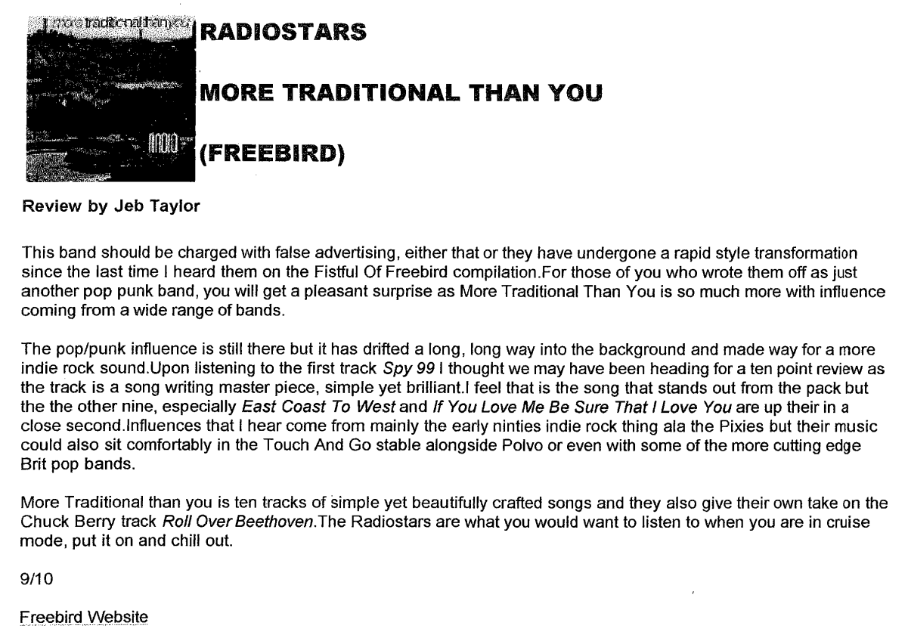

Review by Jeb Taylor for Freebird Website

This band should be charged with false advertising, either that or they have undergone a rapid style transformation since the last time I heard them on the *Fistful Of Freebird* compilation. For those of you who wrote them off as just another pop punk band, you will get a pleasant surprise as More Traditional Than You is so much more with influence coming from a wide range of bands.

The pop/punk influence is still there but it has drifted a long, long way into the background and made way for a more indie rock sound. Upon listening to the first track *Spy 99* I thought we may have been heading for a ten point review as the track is a song writing master piece, simple yet brilliant.! feel that is the song that stands out from the pack but the other nine, especially *East Coast To West* and *If You Love Me Be Sure That I Love You* are up their in a
close second. Influences that I hear come from mainly the early ninties indie rock thing ala the Pixies but their music could also sit comfortably in the Touch And Go stable alongside Polvo or even with some of the more cutting edge Brit pop bands.

*More Traditional than you* is ten tracks of simple yet beautifully crafted songs and they also give their own take on the Chuck Berry track *Roll Over Beethoven*. The Radiostars are what you would want to listen to when you are in cruise mode, put it on and chill out.

9/10

Freebird Website

