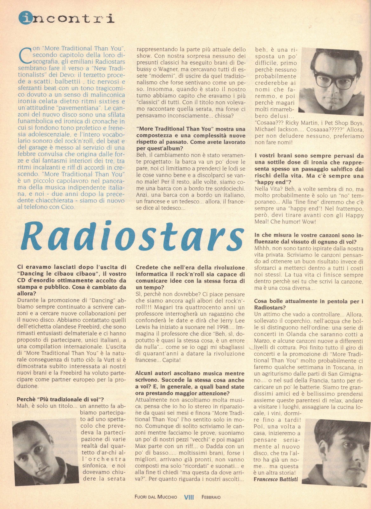
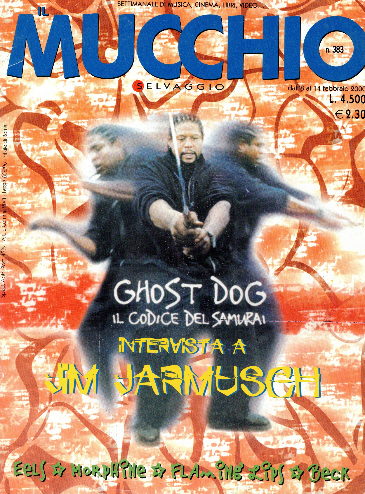

Articolo di Francesco Battisti da [Mucchio Selvaggio](https://it.wikipedia.org/wiki/Il_mucchio_selvaggio_(rivista)) n. 383 febbraio 2000

Con "More Traditional Than you" secondo capitolo della loro discografia, gli emiliani Radiostars sembrano fare il verso a “New Traditionalists” dei Devo: il terzetto procede a scatti, balbettii , tic nervosi e sferzanti beat con un tono tragicomico dovuto a un senso di malinconica ironia celata dietro ritmi sixties e un'attitudine “pavementiana”.
Le canzoni del nuovo disco sono una sfilata funambolica ed ironica di cronache in cui si fondono tono profetico e frenesia adolescenziale, e l’intero vocabolario sonoro del rock'n'’roll, del beat e del garage è messo al servizio di una febbre convulsa che origina dalle forze e dai fantasmi interiori dei tre, tra ritmi incalzanti e riff di accordi in crescendo.
“More Traditional Than You” è un piccolo capolavoro nel panorama della musica indipendente italiana, e noi - due anni dopo la precedente chiacchierata - siamo di nuovo al telefono con Cico.

**Ci eravamo lasciati dopo l’uscita di “Dancing le cibaou cibaou”, il vostro CD d'’esordio ottimamente accolto da stampa e pubblico. Cosa è cambiato da allora?**

Durante la promozione di “Dancing” abbiamo sempre continuato a scrivere canzoni e a cercare nuove collaborazioni per il nuovo disco. Abbiamo contattato quelli dell’etichetta olandese Freebird, che sono rimasti entusiasti delmateriale e ci hanno proposto di partecipare, unici italiani, a una compilation internazionale
L'uscita di “More Traditional Than You” è la naturale conseguenza di tutto ciò: la Vurt si è dimostrata subito interessata ai nostri nuovi brani e la Freebird ha voluto partecipare come partner europeo per la produzione.

**Perchè “Più tradizionale di voi”?**

Mah, è solo un titolo... un annetto fa abbiamo partecipato ad uno spettacolo che prevedeva la partecipazione di varie realtà dal quartetto d’ar-chi all’otchestra sinfonica, e noi
dovevamo chiudere la serata rappresentando la parte più attuale dello show.
Con nostra sorpresa nessuno dei presunti classici ha eseguito brani di Debussy o Wagner, ma cercavano tutti di essere “moderni”, di uscire da quel tradizionalismo che forse sentivano come un peso.
Insomma, quando è stato il nostro turno abbiamo capito che eravamo i più “classici” di tutti. Con il titolo non volevamo raccontare quella serata, ma forse ci pensavamo inconsciamente... chissa?

**“More Traditional Than You” mostra una compostezza e una complessità nuove rispetto al passato. Come avete lavorato per quest’album?**

Beh, il cambiamento non è stato veramente progettato: la barca va un po' dove le pare, noi ci limitiamo a prenderci le lodi se le cose vanno bene e a discolparci se vanno male
Per il resto, alle volte, siamo come una barca con a bordo tre sordociechi.
Anzi, una barca con a bordo un italiano, un francese e un tedesco... allora, il francese dice al tedesco...

**Credete che nell’era della rivoluzione informatica il rock’n’roll sia capace di comunicare idee con la stessa forza di un tempo?**

Sì, perché non dovrebbe? Ci piace pensare che siamo ancora agli albori del rock'n'roll!!! Magari tra quattrocento anni un professore interrogherà un ragazzino che confonderà le date e dirà che Jerry Lee Lewis ha iniziato a suonare nel 1998....
Immagina il professore che dice “Beh, sì, dopotutto è quasi la stessa cosa, è un errore da nulla”... come se io oggi mi sbagliassi di quarant’anni a datare la rivoluzione francese... Capita!

**Alcuni autori ascoltano musica mentre scrivono. Succede la stessa cosa anche a voi? E, in generale, a quali band state ora prestando maggior attenzione?**

Attualmente non ascoltiamo molta musica, pensa che io ho lo stereo in riparazione da quasi sei mesi e finora “More Traditional Than You” l'ho sentito solo in mono.
Comunque di solito scriviamo le canzoni mentre facciamo le prove, suoniamo un po' di nostri pezzi “vecchi” e poi magari Max parte con un riff... o Dadda con un po' di basso..... moltissimi brani, forse i migliori, arrivano già pronti, non vanno composti ma solo “ricordati” e suonati... e alla fine ti chiedi “ma questa da dove arriva?”.
Per quanto riguarda i nostri ascolti... beh, è una risposta un po' difficile, primo perchè nessuno probabilmente crederebbe ai nomi che faremmo, e poi perchè magari molti rimarreb bero delusi... “Cosaaa??? Ricky Martin, i Pet Shop Boys, per non deludere nessuno, preferiamo non fare nomi!

**I vostri brani sono sempre pervasi da una sottile dose di ironia che rappresenta spesso un passaggio salvifico dai rischi della vita. Ma c’è sempre una “happy end”?**

Nella Vita? Beh, a volte sembra di no, ma molto probabilmente è solo un “no” temporaneo... Alla “fine fine” diremmo che c'è sempre una “happy end”! Nel frattempo, però, devi tirare avanti con gli Happy Meal! Che humor! Wow!

**In che misura le vostre canzoni sono influenzate dal vissuto di ognuno di voi?**

Mhhh, non sono tanto ispirate dalla nostra vita privata. Scriviamo le canzoni pensando ad ottenere un buon risultato invece di sforzarci a metterci dentro a tutti i costi noi stessi
La tua vita ci finisce sempre dentro perché sei tu che scrivi la canzone, ma è una cosa diversa...

**Cosa bolle attualmente in pentola per i Radiostars?**

Un attimo che vado a controllare... Allora, sollevato il coperchio, nell’acqua che bolle si distinguono nell’ordine: una serie di concerti in Olanda che saranno cotti a Marzo, e alcune canzoni nuove a differenti livelli di cottura. Poi finito tutto il giro di concerti e la promozione di “More Traditional Than You” molto probabilmente ci faremo qualche settimana in Toscana, in un agriturismo dalle parti di San Gimignano.... o nel sud della Francia, tanto per ricaricare un po' le batterie. Siamo tre grandissimi amici ed è bellissimo prendersi assieme queste parentesi di relax, andare a visitare i luoghi, assaggiare la cucina locale, i vini, dormire fino a tardi!
Poi, una volta a casa, inizieremo a pensare seriamente al nuovo disco, che tra l’altro ha già un nome... ma questa è un altra storia!

Francesco Battisti

