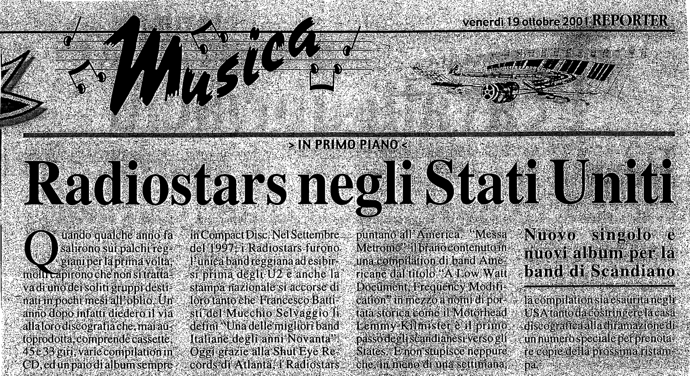

Articolo di Reporter relativo all'uscita del brano Messa Metronic nella compilation Americana

Quando qualche anno fa salirono sui palchi reggiani per la prima volta, molti capirono che non si trattava di uno dei soliti gruppi destinati in pochi mesi all'oblio. Un anno dopo infatti diedero via alla loro discografia che, mai autoprodotta, comprende cassette, 45 e 33 giri, e varie compilation in CD, ed un paio di album sempre in Compact Disc. Nel settembre del 1997, i Radiostars furono l'unica band reggiana ad esibirsi prima degli U2 e anche la stampa nazionale si accorse di loro tanto che Francesco Battisti del Mucchio Selvaggio li definì "Una delle migliori band degli anni Novanta". Oggi grazie alla Shutr Eye Records di Atlanta, i Radiostas puntano all'America. "Messa Metronic" il brano contenuto in yna compilation dal titolo "A Low Watt Document, Frequency Modification" in mezzo a nomi di portata storica come il Motörhead Lemmy Kilmister è il primo passo degli scandianesi verso gli States. E non stupisce neppure che, in meno di una settimana la compilation sia esaurita negli USA tanto da costringere la discografica alla diramazione di un numero speciale per prenotare le copie della prossima ristampa.
