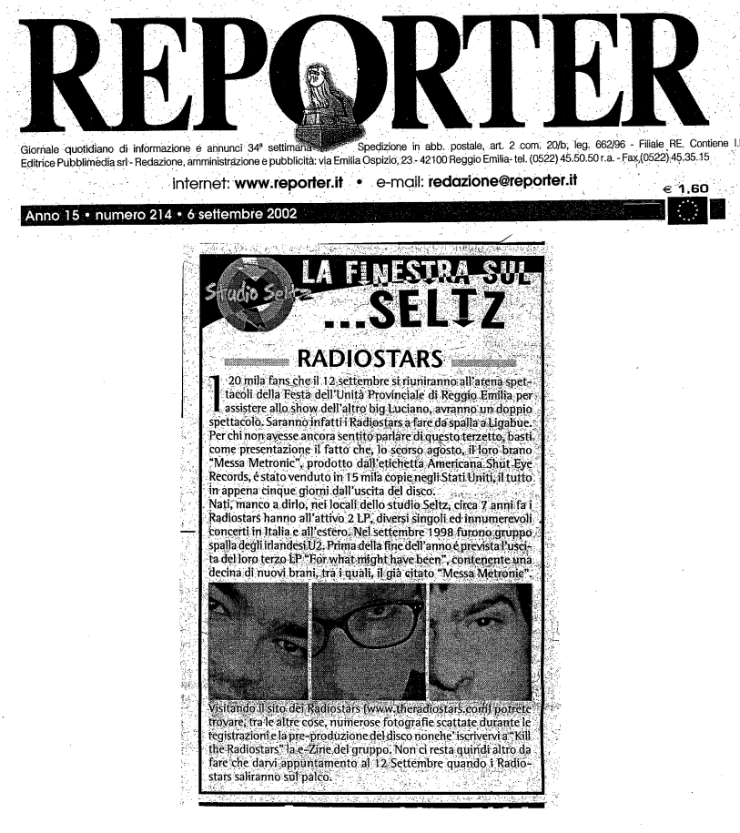

Riferimenti dell'articolo: es. autore rivista ecc.

I ventimila fans che il 12 settembre si riuniranno all'arena spettacoli della Festa dell'Unità Provinciale di Reggio Emilia per assistere allo show dell'altro big Luciano, avranno un doppio spettacolo. Saranno infatti i Radiostars a fare da spalla a Ligabue.
Per chi non avesse ancora sentito parlare del terzetto, basti come presentazione il fatto che, lo scorso agosto, il loro brano "Messa Metronic", prodotto dall'etichetta Americana Shut Eye Records, è stato venduto in 15 mila copie negli Stati Uniti, il tutto in appena cinque giorni dall'uscita del disco.
Nati, manco a dirlo, nei locali dello studio Seltz, circa 7 anni fa i Radiostars hanno all'attivo 2 LP, diversi singoli e innumerevoli concerti in Italia e all'estero. Nel settembre del 1998 furono gruppo di spalla degli irlandesi U2. Prima della fine dell'anno è prevista l'uscita del loro terzo LP "For what might have been", contenete una decina di nuovi brani, trai quali, il già citato "Messa Metronic".
Visitando il sito www.theradiostars.com potrete trovare, tra le altre cose, numerose fotografie scattate durante le registrazioni e la pre-produzione del disco nonché iscriversi a "Kill the radiostars" la e-zine del gruppo. Non ci resta quindi altro da fare che darvi appuntamento al 12 settembre quando i Radiostars saliranno sul palco.
