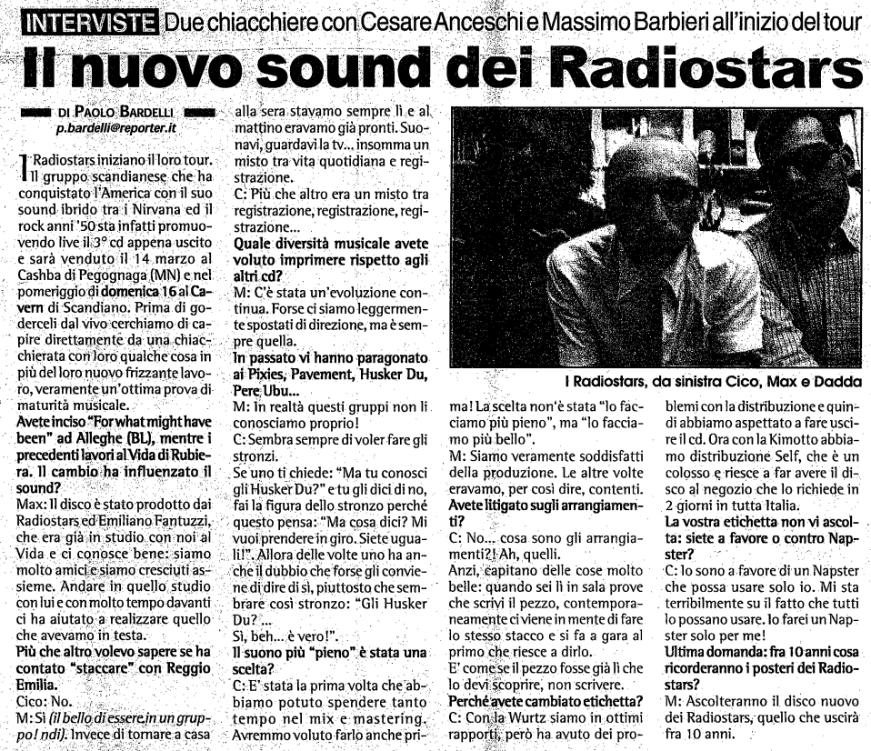

Intervista di Paolo Bardelli per Reporter (Anno 16, n.64)

**INTERVISTE: Due chiacchiere con Cerare Anceschi e Massimo Barbieri all'inizio del tour**

**Il nuovo sound dei Radiostars**

I Radiostars iniziano il loro tour. Il gruppo scandianese che ha conquistato l’America con il suo sound ibrido travi Nirvana ed il rock anni ‘50 sta infatti promuovendo live il 3° cd appena uscito e sarà venduto il 14 marzo al Cashba di Pegognaga (MN) e nel pomeriggio di domenica 16 al Cavern di Scandiano. Prima.di goderceli dal vivo cerchiamo di capire direttamente da una chiacchierata con loro qualche cosa in più del loro nuovo frizzante lavoro, veramente un'ottima prova di maturità musicale.

**Avete inciso “For what might have been” ad Alleghe (BL), mentre i precedenti lavori al Vida di Rubiera. Il cambio ha influenzato il sound?**

Max: Il disco è stato prodotto dai Radiostars ed Emiliano Fantuzzi, che era già in studio con noi al Vida e ci conosce bene: siamo molto amici e siamo cresciuti assieme. Andare in quello studio con lui e con molto tempo davanti ci ha aiutato a realizzare quello che avevamo in testa.

**Più che altro volevo sapere se ha contato “staccare” con Reggio Emilia.**

Cico: No.

Max: Sì *(il bello di essere in un gruppo! ndi)* Invece di tornare a casa alla sera stavamo sempre lì e al, mattino eravamo già pronti. Suonavi, guardavi la tv... insomma un misto tra vita quotidiana e registrazione.

C: Più che altro era un misto tra registrazione; registrazione, registrazione...

**Quale diversità musicale avete voluto imprimere rispetto agli altri cd?**

M: C'è stata un'evoluzione continua. Forse ci siamo leggermente spostati di direzione ma è sempre quella.

**In passato vi hanno paragonato ai: Pixies, Pavement, Husker Du, Pere; Ubu...**

M: In realtà questi gruppi non li conosciamo proprio!

C: Sembra sempre di voler fare gli stronzi. Se uno ti chiede: “Ma tu conosci gli Husker Du?” e tu gli dici di no, fai la figura dello stronzo perché questo pensa: Ma cosa dici? Mi vuoi prendere in giro. Siete uguali? Allora delle volte uno ha anche il dubbio che forse gli conviene di dire di sì, piuttosto che sembrare così stronzo: “Gli Husker Du?
Sì, beh....è vero!

**Il suono più “pieno!"è stata una scelta?**

C: È stata la prima volta che abbiamo potuto spendere tanto tempo nel'mix e mastering. Avremmo voluto farlo anche prima! La.scelta non è stata “lo facciamo più pieno”, ma “lo facciamo più bello”.

M: Siamo veramente soddisfatti della produzione. Le altre volte eravamo, per così dire, contenti. Avete litigato sugli arrangiamenti?

C: No....cosa sono gli arrangiamenti?! Ah, quelli. Anzi, capitano delle cose molto belle: quando sei lì in sala prove che scrivi il pezzo, contemporaneamente ci viene in mente di fare
lo stesso stacco e si fa a gara al primo che riesce a dirlo.

È come se il pezzo fosse già lì che lo devi scoprire, non scrivere.

**Perché avete cambiato etichetta?**
C: Con Vurt siamo in ottimi rapporti,però ha avuto problemi con la distribuzione e quindi abbiamo aspettato a fare uscire il cd. Ora con la Kimotto abbiamo distribuzione Self, che è un
colosso e riesce a far avere il disco al negozio che lo richiede in 2 giorni in tutta Italia.

**La vostra etichetta non vi ascolta: siete a favore o contro Napster?**

C: Io sono a favore di un Napster che possa usare solo io. Mi sta terribilmente su il fatto che tutti lo possano usare. Io farei un Napster solo per me!

**Ultima domanda: fra 10anni cosa ricorderanno i posteri dei Radiostars?**

M: Ascolteranno il disco nuovo dei Radiostars; quello che uscirà fra 10 anni.
