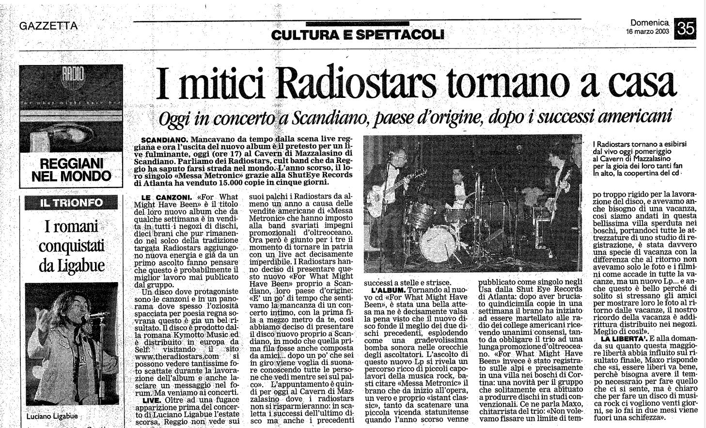

Articolo della Gazzetta di Reggio 16 marzo 2003

SCANDIANO. Mancavano da tempo:dalla scena live reggiana e ora l'uscita del nuovo album è il pretesto per un live fulminante, oggi (ore-17) al Cavern di Mazzalasino di Scandiano. Parliamo dei Radiostars, cult band che da Reggio ha saputo farsi strada nel mondo. L’anno scorso, il loro singolo «Messa Metronic» grazie alla ShutEye Records di Atlanta ha venduto 15.000 copie in cinque giorni.

**LE CANZONI.** «For. What Might Have Been». è il titolo del loro nuovo album che da qualche settimana è in vendita in tutti i negozi di dischi, dieci brani che pur rimanendo nel solco della tradizione targata Radiostars aggiungono nuova energia e già da un primo ascolto fanno pensare che questo è probabilmente il miglior lavoro mai pubblicato dal gruppo.

Un disco dove protagoniste sono le canzoni e in un panorama dove spesso l’oziosità spacciata per poesia regna sovrana questo è già un bel risultato. Il disco è prodotto dalla romana Kymotto Music ed è distribuito in Europa da Self: visitando il sito www.theradiostars.com si possono vedere tantissime foto scattate durante la lavorazione dell’album e anche lasciare un messaggio nel forum. Ma veniamo ai concerti.

**LIVE.** Oltre ad una fugace apparizione prima del concerto di Luciano Ligabue l'estate scorsa, Reggio non vede sui suoi palchi i Radiostars da almeno un anno a causa delle vendite americane di «Messa Metronic» che hanno imposto alla band svariati impegni promozionali d’oltreoceano. Ora però è giunto per i tre il momento di tornare in patria con un live act decisamente imperdibile. I Radiostars hanno deciso di presentare questo nuovo «For What Might
Have Been» proprio a Scandiano, loro paese d'origine: «E un po’ di tempo che sentivamo la mancanza di un concerto intimo, con la prima fila a mezzo metro da te, così abbiamo deciso di presentare il disco nuovo proprio a Scandiano, in modo che quella prima fila fosse anche composta da amici... dopo un po' che sei in giro viene voglia di suonare conoscendo tutte le persone che vedi mentre sei sul palco». L'appuntamento è quindi per oggi al Cavern di Mazzalasino dove i Radiostars non si risparmieranno: in scaletta i successi dell’ultimo disco ma anche i precedenti successi a stelle e strisce.

**L'ALBUM.** Tornando al nuovo cd «For What Might Have Been», è stata una bella attesa ma ne è decisamente valsa la pena visto che il nuovo disco fonde il meglio dei due dischi precedenti, esplodendo come una gradevolissima bomba sonora nelle orecchie degli ascoltatori. L'ascolto di
questo nuovo Lp si rivela un percorso ricco di piccoli capolavori della musica rock, basti citare «Messa Metronic» il brano che da inizio all'opera, un vero e proprio «istant classic», tanto da scatenare una piccola vicenda statunitense quando l’anno scorso venne pubblicato come singolo negli USA dalla Shut Eye Records di Atlanta: dopo aver bruciato quindicimila copie in una settimana il brano ha iniziato ad essere martellato alle radio dei college americani ricevendo unanimi consensi, tanto da obbligare il trio ad una lunga promozione d’oltreoceano. «For. What. Might Have Been» invece è stato registrato sulle Alpi e precisamente in una villa nei boschi di Cortina: una novità per il gruppo che solitamente era abituato produrre dischi in studi convenzionali. Ce ne parla Maxo, chitarrista del trio: «Non volevamo fissare un limite di tempo troppo rigido per la lavorazione del disco, e avevamo anche bisogno di una vacanza, così siamo andati in questa bellissima villa sperduta nei boschi, portandoci tutte le attrezzature di uno studio di registrazione, è stata davvero una specie di vacanza con la differenza che al ritorno non avevamo solo le foto e i filmini come accade in tutte la vacanze, ma un nuovo Lp... e anche questo è bello perché di solito si stressano gli amici per mostrare loro le foto al ritorno dalle vacanze, il nostro ricordo della vacanza è addirittura distribuito nei negozi. Meglio di così».

**LA LIBERTÀ.** E alla domanda su quanto questa maggiore libertà abbia influito sul risultato finale, Maxo risponde che «sì, essere liberi va bene, perchè bisogna avere il tempo necessraio per fare quello che ci si sente, ma è chiaro che per fare un disco di musica rock ci vogliono venti giorni, se lo fai in due mesi viene fuori una schifezza».
