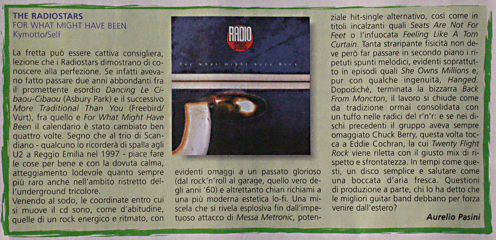

Recensione di Aurelio Pasini per Mucchio Selvaggio num. 525

**THE RADIOSTARS - FOR WHAT MIGHT HAVE BEEN**

*Kymotto/Self*

La fretta può essere cattiva consigliera, lezione che i Radiostars dimostrano di conoscere alla perfezione.
Se infatti avevano fatto passare due anni abbondanti fra il promettente esordio *Dancing Le Cibaou-Cibaou (Asbury Park)* e il successivo *More Traditional Than You (Freebird/Vurt)*, fra quello e *For What Might Have Been* il calendario è stato cambiato ben quattro volte. Segno che al trio di Scandiano - qualcuno lo ricorderà di spalla agli U2 a Reggio Emilia nel 1997 - piace fare le cose per bene e con la dovuta calma, atteggiamento lodevole quanto sempre più raro anche nell'ambito ristretto dell'underground tricolore.

Venendo al sodo, le coordinate entro cui si muove il cd sono, come d'abitudine, quelle di un rock energico e ritmato, con evidenti omaggi a un passato glorioso (dal rock'n'roll al garage, quello vero degli anni ‘60) e altrettanto chiari richiami a una più moderna estetica lo-fi. Una miscela che si rivela esplosiva fin dall'impetuoso attacco di *Messa Metronic*, potenziale hit-single alternativo, così come in titoli incalzanti quali *Seats Are Not For Feet* o l'infuocata *Feeling Like A Torn Curtain*. Tanta straripante fisicità non deve però far passare in secondo piano i ripetuti spunti melodici, evidenti soprattutto in episodi quali *She Owns Millions* e, pur con qualche ingenuità, *Hanged*.
Dopodiché, terminata la bizzarra *Back From Moncton*, il lavoro sì chiude come da tradizione ormai consolidata con un tuffo nelle radici del r'n'r: e se nei dischi precedenti il gruppo aveva sempre omaggiato Chuck Berry, questa volta tocca a Eddie Cochran, la cui *Twenty Flight Rock* viene riletta con il giusto mix di rispetto e sfrontatezza. In tempi come questi, un disco semplice e salutare come una boccata d'aria fresca. Questioni di produzione a parte, chi lo ha detto che le migliori guitar band debbano per forza venire dall'estero?
