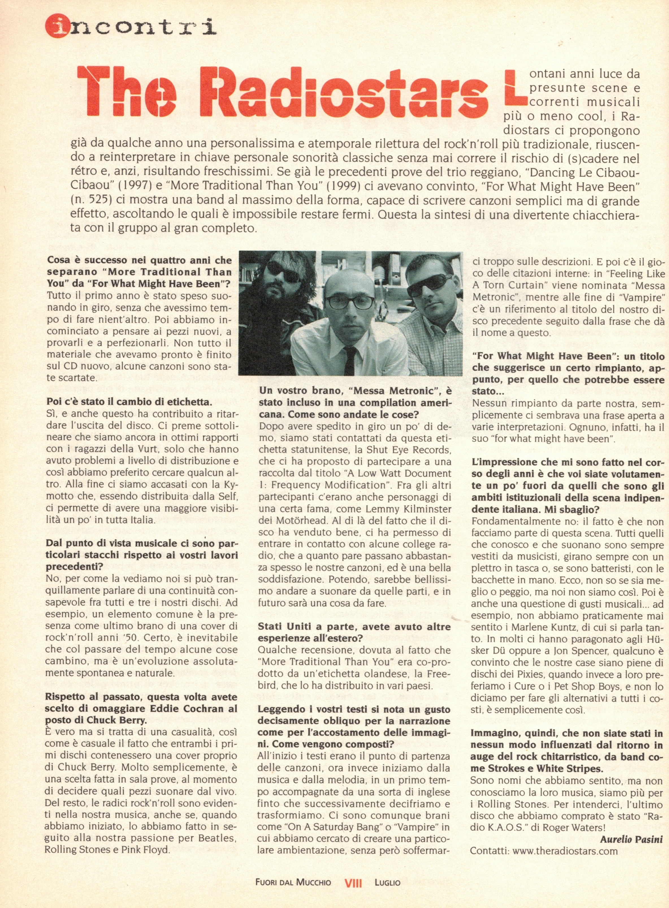
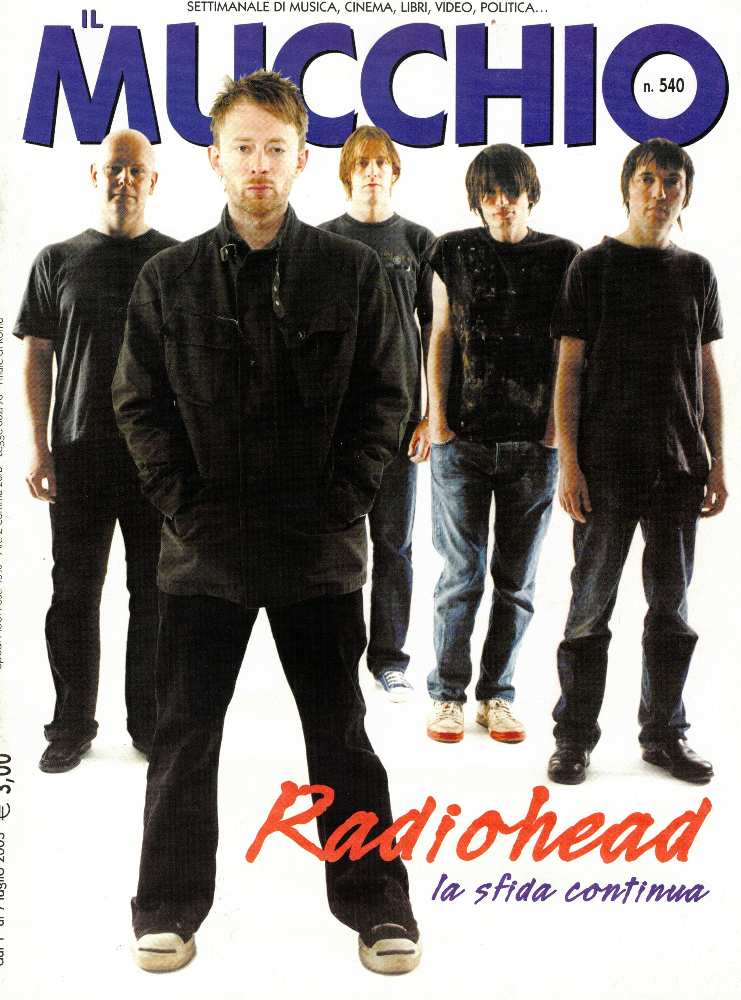

Articolo di Aurelio Pasini

Lontani anni luce da presunte scene e correnti musicali i Radiostars ci propongono già da qualche anno una personalissima e atemporale rilettura del rock'n’roll più tradizionale, riuscendo a reinterpretare in chiave personale sonorità classiche senza mai correre il rischio di (s)cadere nel rétro e, anzi, risultando freschissimi.
Se già le precedenti prove del trio reggiano, “Dancing Le Cibaou-Cibaou” (1997) e “More Traditional Than You” (1999) ci avevano convinto, “For What Might Have Been”
(n. 525) ci mostra una band al massimo della forma, capace di scrivere canzoni semplici ma di grande effetto, ascoltando le quali è impossibile restare fermi. Questa la sintesi di una divertente chiacchierata con il gruppo al gran completo.

**Cosa è successo nei quattro anni che separano “More Traditional Than You” da “For What Might Have Been”?**

Tutto il primo anno è stato speso suonando in giro, senza che avessimo tempo di fare nient'altro. Poi abbiamo incominciato a pensare ai pezzi nuovi, a provarli e a perfezionarli. Non tutto il materiale che avevamo pronto è finito sul CD nuovo, alcune canzoni sono state scartate.

**Poi c'è stato il cambio di etichetta.**

Sì, e anche questo ha contribuito a ritardare l’uscita del disco. Ci preme sottolineare che siamo ancora in ottimi rapporti con i ragazzi della Vurt, solo che hanno avuto problemi a livello di distribuzione e così abbiamo preferito cercare qualcun altro. Alla fine ci siamo accasati con la Kymotto che, essendo distribuita dalla Self, ci permette di avere una maggiore visibilità un po' in tutta Italia.

**Dal punto di vista musicale ci sono particolari stacchi rispetto ai vostri lavori precedenti?**

No, per come la vediamo noi si può tranquillamente parlare di una continuità consapevole fra tutti e tre i nostri dischi. Ad esempio, un elemento comune è la presenza come ultimo brano di una cover di rock'n’roll anni ‘50. Certo, è inevitabile che col passare del tempo alcune cose cambino, ma è un’evoluzione assolutamente spontanea e naturale.

**Rispetto al passato, questa volta avete scelto di omaggiare Eddie Cochran al posto di Chuck Berry.**

È vero ma si tratta di una casualità, così come è casuale il fatto che entrambi i primi dischi contenessero una cover proprio di Chuck Berry. Molto semplicemente, è una scelta fatta in sala prove, al momento di decidere quali pezzi suonare dal vivo.
Del resto, le radici rock'n’roll sono evidenti nella nostra musica, anche se, quando abbiamo iniziato, lo abbiamo fatto in seguito alla nostra passione per Beatles, Rolling Stones e Pink Floyd.

**Un vostro brano, “Messa Metronic”, è stato incluso in una compilation americana. Come sono andate le cose?**

Dopo avere spedito in giro un po' di demo, siamo stati contattati da questa etichetta statunitense, la Shut Eye Records, che ci ha proposto di partecipare a una raccolta dal titolo “A Low Watt Document 1: Frequency Modification”.
Fra gli altri partecipanti c'erano anche personaggi di una certa fama, come Lemmy Kilminster dei Motòrhead. AI di 1à del fatto che il disco ha venduto bene, ci ha permesso di entrare in contatto con alcune college radio, che a quanto pare passano abbastanza spesso le nostre canzoni, ed è una bella soddisfazione. Potendo, sarebbe bellissimo andare a suonare da quelle parti, e in futuro sarà una cosa da fare.

**Stati Uniti a parte, avete avuto altre esperienze all’estero?**

Qualche recensione, dovuta al fatto che “More Traditional Than You” era co-prodotto da un’etichetta olandese, la Freebird, che lo ha distribuito in vari paesi.

**Leggendo i vostri testi si nota un gusto decisamente obliquo per la narrazione come per l’accostamento delle immagini. Come vengono composti?**

All’inizio i testi erano il punto di partenza delle canzoni, ora invece iniziamo dalla musica e dalla melodia, in un primo tempo accompagnate da una sorta di inglese finto che successivamente decifriamo e trasformiamo.
Ci sono comunque brani come “On A Saturday Bang” o “Vampire” in cui abbiamo cercato di creare una particolare ambientazione, senza però soffermarci troppo sulle descrizioni.
E poi c'è il gioco delle citazioni interne: in “Feeling Like A Torn Curtain” viene nominata “Messa Metronic”, mentre alle fine di “Vampire” c'è un riferimento al titolo del nostro disco precedente seguito dalla frase che dà il nome a questo.

**“For What Might Have Been”: un titolo che suggerisce un certo rimpianto, appunto, per quello che potrebbe essere stato...**

Nessun rimpianto da parte nostra, semplicemente ci sembrava una frase aperta a varie interpretazioni. Ognuno, infatti, ha il suo “for what might have been”.

**L’impressione che mi sono fatto nel corso degli anni è che voi siate volutamente un po'’ fuori da quelli che sono gli ambiti istituzionali della scena indipendente italiana. Mi sbaglio?**

Fondamentalmente no: il fatto è che non facciamo parte di questa scena. Tutti quelli che conosco e che suonano sono sempre vestiti da musicisti, girano sempre con un plettro in tasca o, se sono batteristi, con le bacchette in mano.
Ecco, non so se sia meglio o peggio, ma noi non siamo così. Poi è anche una questione di gusti musicali... ad esempio, non abbiamo praticamente mai sentito i Marlene Kuntz, di cui si parla tanto.
In molti ci hanno paragonato agli Hisker Diù oppure a Jon Spencer, qualcuno è convinto che le nostre case siano piene di dischi dei Pixies, quando invece a loro preferiamo i Cure o i Pet Shop Boys, e non lo diciamo per fare gli alternativi a tutti i costi, è semplicemente così.

**Immagino, quindi, che non siate stati in nessun modo influenzati dal ritorno in auge del rock chitarristico, da band come Strokes e White Stripes.**

Sono nomi che abbiamo sentito, ma non conosciamo la loro musica, siamo più per i Rolling Stones. Per intenderci, l’ultimo disco che abbiamo comprato è stato “Radio K.A.O.S.” di Roger Waters!

Aurelio Pasini
Contatti: www.theradiostars.com

