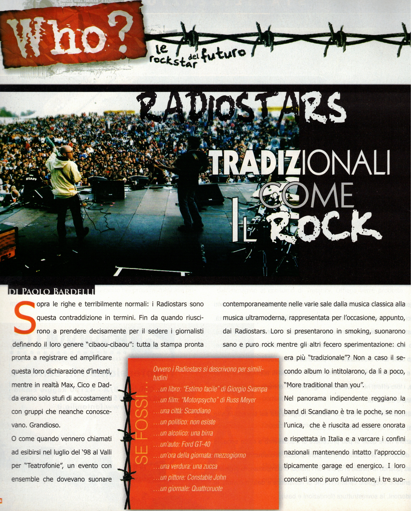
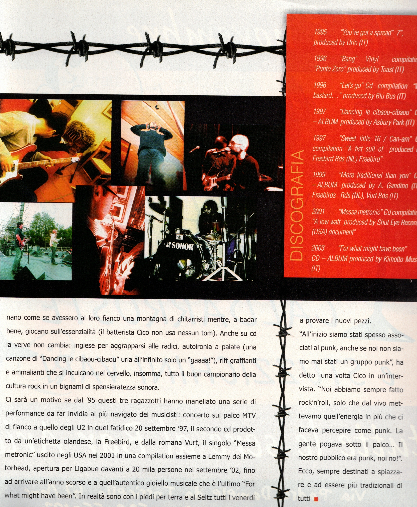
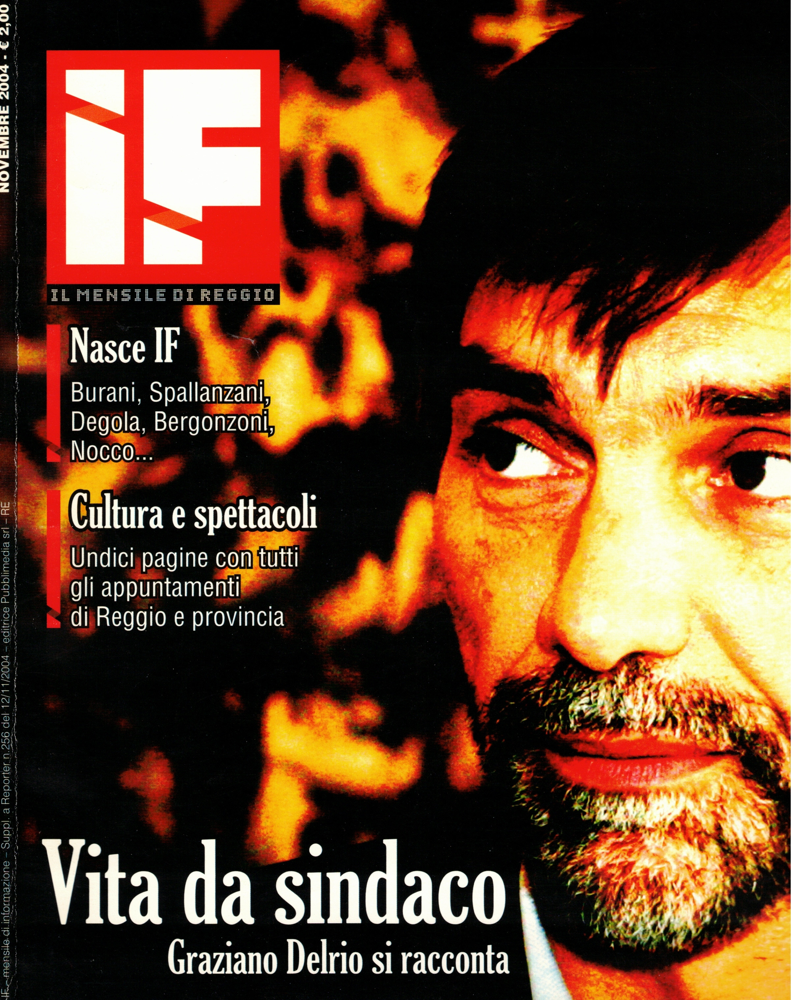

Articolo di Paolo Bardelli per la rivista IF (novembre 2004)

Sopra le righe e terribilmente normali: i Radiostars sono questa contraddizione in termini.
Fin da quando riuscirono a prendere decisamente per il sedere i giornalisti definendo il loro genere “cibaou-cibaou”: tutta la stampa pronta pronta a registrare ed amplificare questa loro dichiarazione d’intenti, mentre in realtà Max, Cico e Dadda erano solo stufi di accostamenti con gruppi che neanche conoscevano. Grandioso.
O come quando vennero chiamati ad esibirsi nel luglio del ‘98 al Valli per “Teatrofonie”, un evento con ensemble che dovevano suonare contemporaneamente nelle varie sale dalla musica classica alla musica ultramoderna, rappresentata per l’occasione, appunto, dai Radiostars.
Loro si presentarono in smoking, suonarono sano e puro rock mentre gli altri fecero sperimentazione: chi era più “tradizionale”? Non a caso il secondo album lo intitolarono, da lì a poco, “More traditional than you”.
Nel panorama indipendente reggiano la band di Scandiano è tra le poche, se non l’unica, che è riuscita ad essere onorata e rispettata in Italia e a varcare i confini nazionali mantenendo intatto l’approccio tipicamente garage ed energico.
I loro concerti sono puro fulmicotone, i tre suonano come se avessero al loro fianco una montagna di chitarristi mentre, a badar bene, giocano sull’essenzialità (il batterista Cico non usa nessun tom).
Anche su cd la verve non cambia: inglese per aggrapparsi alle radici, autoironia a palate (una canzone di “Dancing le cibaou-cibaou” urla all’infinito solo un “gaaaa!”), riff graffianti e ammalianti che si inculcano nel cervello, insomma, tutto il buon campionario della cultura rock in un bignami di spensieratezza sonora.
Ci sarà un motivo se dal ’95 questi tre ragazzotti hanno inanellato una serie di performance da far invidia al più navigato dei musicisti: concerto sul palco MTV di fianco a quello degli U2 in quel fatidico 20 settembre ‘97, il secondo cd prodotto da un’etichetta olandese, la Freebird, e dalla romana Vurt, il singolo “Messa metronic” uscito negli USA nel 2001 in una compilation assieme a Lemmy dei Motorhead, apertura per Ligabue davanti a 20 mila persone nel settembre ’02, fino ad arrivare all’anno scorso e a quell’autentico gioiello musicale che è l’ultimo “For what might have been”. In realtà sono con i piedi per terra e al Seltz tutti i venerdì a provare i nuovi pezzi.

“All’inizio siamo stati spesso associati al punk, anche se noi non siamo mai stati un gruppo punk”, ha detto una volta Cico in un’intervista. “Noi abbiamo sempre fatto
rock'n’roll, solo che dal vivo mettevamo quell’energia in più che ci faceva percepire come punk. La gente pogava sotto il palco... Il nostro pubblico era punk, noi no!”.
Ecco, sempre destinati a spiazzare e ad essere più tradizionali di tutti

