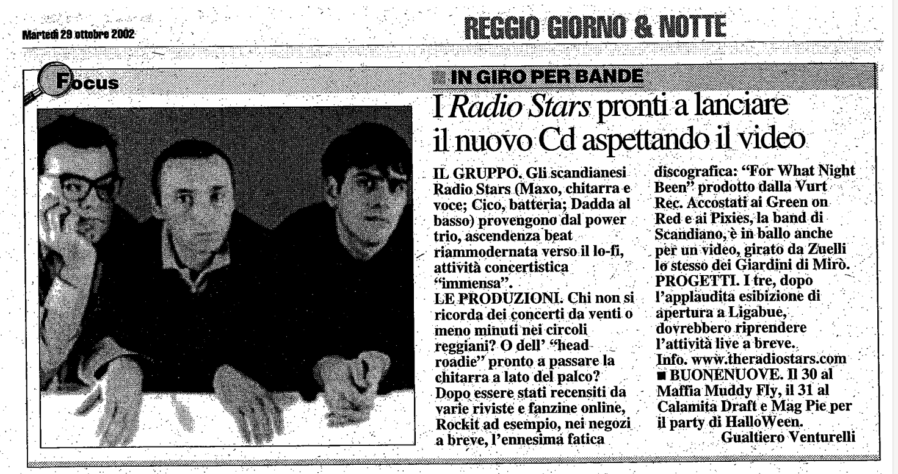

Riferimenti dell'articolo: es. autore rivista ecc.

IL GRUPPO. Gli scandianesi Radiostars (Maxo, chitarra e voce; Cico, batteria; Dadda al basso) provengono dal power trio, ascendenza beat riammodernata verso il lo-fi, attività concertistica “immensa”.

LE PRODUZIONI: Chi non si ricorda dei concerti da venti o meno minuti nei circoli reggiani? O dell’"head roadie” pronto a passare la chitarra a lato del palco?
Dopo. essere stati recensiti da varie riviste e fanzine online, Rockit ad esempio, nei negozi
a breve, l'ennesima fatica discografica: “For What Might Been” prodotto dalla Vurt Rec. Accostati ai Green on Red e ai Pixies,la band di Scandiano; è in ballo anche per un video, girato da Zuelli lo stessò dei Giardini di Mirò.

PROGETTI. I tre, dopo l’applaudita esibizione di apertura a Ligabué, dovrebbero riprendere
l’attività live a breve. Info. www.theradiostars.com

BUONENUOVE. Il 30 al Maffia Muddy Fly, il 31 al Calamita Draft e Mag Pie per il party di HalloWeen.

Gualtiero Venturelli
